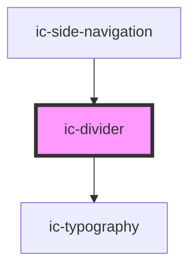

# ic-divider

<!-- Auto Generated Below -->

## Properties

| Property         | Attribute         | Description                                                                                                                                                                                                                                                                              | Type                                                              | Default        |
| ---------------- | ----------------- | ---------------------------------------------------------------------------------------------------------------------------------------------------------------------------------------------------------------------------------------------------------------------------------------- | ----------------------------------------------------------------- | -------------- |
| `borderStyle`    | `border-style`    | The line style of the divider.                                                                                                                                                                                                                                                           | `"dashed" \| "solid" \| undefined`                                | `"solid"`      |
| `label`          | `label`           | The label for the divider. The label placement will need to be set for the label to be displayed correctly.                                                                                                                                                                              | `string \| undefined`                                             | `undefined`    |
| `labelPlacement` | `label-placement` | The position the label is placed on the divider. `Left` and `right` placement is only applicable when orientation is set to `horizontal`. `Top` and `bottom` placement is only applicable when orientation is set to `vertical`. `Center` placement is applicable for both orientations. | `"bottom" \| "center" \| "left" \| "right" \| "top" \| undefined` | `"center"`     |
| `monochrome`     | `monochrome`      | If `true`, the divider will be displayed in a grey colour.                                                                                                                                                                                                                               | `boolean \| undefined`                                            | `false`        |
| `orientation`    | `orientation`     | The orientation of the divider.                                                                                                                                                                                                                                                          | `"horizontal" \| "vertical" \| undefined`                         | `"horizontal"` |
| `theme`          | `theme`           | Sets the theme color to the dark or light theme color. "inherit" will set the color based on the system settings or ic-theme component.                                                                                                                                                  | `"dark" \| "default" \| "inherit" \| "light" \| undefined`        | `"inherit"`    |
| `weight`         | `weight`          | The thickness of the divider.                                                                                                                                                                                                                                                            | `"medium" \| "thick" \| "thin" \| "very-thick" \| undefined`      | `"thin"`       |

## CSS Custom Properties

| Name                                 | Description                                                                                                                                                                                |
| ------------------------------------ | ------------------------------------------------------------------------------------------------------------------------------------------------------------------------------------------ |
| `--ic-divider-background`            |                                                                                                                                                                                            |
| `--ic-divider-background-monochrome` |                                                                                                                                                                                            |
| `--ic-divider-horizontal-width`      | The width of a horizontal divider. The default value is `inherit`.                                                                                                                         |
| `--ic-divider-label`                 |                                                                                                                                                                                            |
| `--ic-divider-label-monochrome`      |                                                                                                                                                                                            |
| `--ic-divider-label-width`           | The max-width of the divider label. When orientation is set to `horizontal`, the default value is `max(20rem, 60%)`. When orientation is set to `vertical`, the default value is `20 rem`. |
| `--ic-divider-vertical-height`       | The height of a vertical divider. The default value is `inherit`.                                                                                                                          |

## Dependencies

### Used by

 - [ic-side-navigation](../ic-side-navigation)

### Depends on

- [ic-typography](../ic-typography)

### Graph

----------------------------------------------

