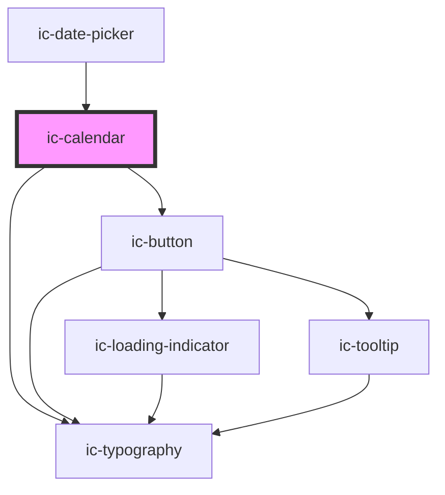

# ic-calendar

<!-- Auto Generated Below -->

## Properties

| Property               | Attribute                 | Description                                                                                                                                                                                                                                            | Type                                                                                                                                                      | Default             |
| ---------------------- | ------------------------- | ------------------------------------------------------------------------------------------------------------------------------------------------------------------------------------------------------------------------------------------------------ | --------------------------------------------------------------------------------------------------------------------------------------------------------- | ------------------- |
| `dateFormat`           | `date-format`             | The format in which the date will be displayed.                                                                                                                                                                                                        | `"DD/MM/YYYY" \| "MM/DD/YYYY" \| "YYYY/MM/DD"`                                                                                                            | `"DD/MM/YYYY"`      |
| `disableDays`          | --                        | The days of the week to disable.                                                                                                                                                                                                                       | `IcWeekDays[] \| undefined`                                                                                                                               | `[]`                |
| `disableFuture`        | `disable-future`          | If `true`, dates in the future are not allowed.                                                                                                                                                                                                        | `boolean \| undefined`                                                                                                                                    | `false`             |
| `disablePast`          | `disable-past`            | If `true`, dates in the past are not allowed.                                                                                                                                                                                                          | `boolean \| undefined`                                                                                                                                    | `false`             |
| `disabled`             | `disabled`                | If `true`, the disabled state will be set.                                                                                                                                                                                                             | `boolean`                                                                                                                                                 | `false`             |
| `max`                  | `max`                     | The latest date that will be allowed. The value can be in any format supported as `dateFormat`, in ISO 8601 date string format (`yyyy-mm-dd`) or as a JavaScript `Date` object. The value of this prop is ignored if `disableFuture` is set to `true`. | `Date \| string`                                                                                                                                          | `""`                |
| `min`                  | `min`                     | The earliest date that will be allowed. The value can be in any format supported as `dateFormat`, in ISO 8601 date string format (`yyyy-mm-dd`) or as a JavaScript `Date` object. The value of this prop is ignored if `disablePast` is set to `true`. | `Date \| string`                                                                                                                                          | `""`                |
| `openAtDate`           | `open-at-date`            | The date visible when the calendar opens. Used if no date is currently selected. The value can be in any format supported as `dateFormat`, in ISO 8601 date string format (`yyyy-mm-dd`) or as a JavaScript `Date` object.                             | `Date \| string`                                                                                                                                          | `""`                |
| `showClearButton`      | `show-clear-button`       | If `true`, the `Clear` button on the calendar will be visible.                                                                                                                                                                                         | `boolean \| undefined`                                                                                                                                    | `true`              |
| `showDaysOutsideMonth` | `show-days-outside-month` | If `true`, days outside the current month will be visible in the calendar.                                                                                                                                                                             | `boolean \| undefined`                                                                                                                                    | `true`              |
| `showTodayButton`      | `show-today-button`       | If `true`, the `Go to today` button on the calendar will be visible.                                                                                                                                                                                   | `boolean \| undefined`                                                                                                                                    | `true`              |
| `size`                 | `size`                    | The size of the calendar to be displayed.                                                                                                                                                                                                              | `"large" \| "medium" \| "small"`                                                                                                                          | `"medium"`          |
| `startOfWeek`          | `start-of-week`           | The first day of the week. `0` for Sunday, `1` for Monday, etc. Default is Monday.                                                                                                                                                                     | `IcWeekDays.Friday \| IcWeekDays.Monday \| IcWeekDays.Saturday \| IcWeekDays.Sunday \| IcWeekDays.Thursday \| IcWeekDays.Tuesday \| IcWeekDays.Wednesday` | `IcWeekDays.Monday` |
| `theme`                | `theme`                   | Sets the calendar to the dark or light theme colors. "inherit" will set the color based on the system settings or ic-theme component.                                                                                                                  | `"dark" \| "inherit" \| "light" \| undefined`                                                                                                             | `"inherit"`         |
| `value`                | `value`                   | The value of the calendar and the date visible when the calendar opens. The value can be in any format supported as `dateFormat`, in ISO 8601 date string format (`yyyy-mm-dd`) or as a JavaScript `Date` object.                                      | `Date \| null \| string \| undefined`                                                                                                                     | `""`                |

## Events

| Event                        | Description                         | Type                                           |
| ---------------------------- | ----------------------------------- | ---------------------------------------------- |
| `icCalendarClearButtonClick` | Emitted when the value has changed. | `CustomEvent<void>`                            |
| `icCalendarDaySelect`        | Emitted when a day is selected.     | `CustomEvent<void>`                            |
| `icCalendarMonthSelect`      | Emitted when a month is selected.   | `CustomEvent<void>`                            |
| `icCalendarYearSelect`       | Emitted when a year is selected.    | `CustomEvent<void>`                            |
| `icChange`                   | Emitted when the value has changed. | `CustomEvent<{ selectedDate: Date \| null; }>` |

## CSS Custom Properties

| Name                    | Description          |
| ----------------------- | -------------------- |
| `--ic-z-index-calendar` | z-index of calendar. |

## Dependencies

### Used by

 - [ic-date-picker](../ic-date-picker)

### Depends on

- ic-button
- ic-typography

### Graph

----------------------------------------------

