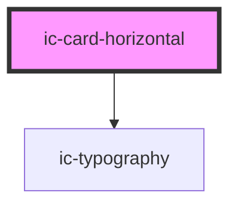

# ic-horizontal-card

<!-- Auto Generated Below -->

## Properties

| Property         | Attribute        | Description                                                                                                                                                       | Type                                                                                                                                                                                                  | Default     |
| ---------------- | ---------------- | ----------------------------------------------------------------------------------------------------------------------------------------------------------------- | ----------------------------------------------------------------------------------------------------------------------------------------------------------------------------------------------------- | ----------- |
| `clickable`      | `clickable`      | If `true`, the horizontal card will be a clickable variant, instead of static.                                                                                    | `boolean`                                                                                                                                                                                             | `false`     |
| `disabled`       | `disabled`       | If `true`, the horizontal card will be disabled if it is clickable.                                                                                               | `boolean`                                                                                                                                                                                             | `false`     |
| `heading`        | `heading`        | The heading for the horizontal card. This is required, unless a slotted heading is used.                                                                          | `string \| undefined`                                                                                                                                                                                 | `undefined` |
| `href`           | `href`           | The URL that the clickable horizontal card link points to. If set, the clickable horizontal card will render as an "a" tag, otherwise it will render as a button. | `string \| undefined`                                                                                                                                                                                 | `undefined` |
| `hreflang`       | `hreflang`       | The human language of the linked URL.                                                                                                                             | `string \| undefined`                                                                                                                                                                                 | `""`        |
| `message`        | `message`        | The main body message of the horizontal card.                                                                                                                     | `string \| undefined`                                                                                                                                                                                 | `""`        |
| `referrerpolicy` | `referrerpolicy` | How much of the referrer to send when following the link.                                                                                                         | `"" \| "no-referrer" \| "no-referrer-when-downgrade" \| "origin" \| "origin-when-cross-origin" \| "same-origin" \| "strict-origin" \| "strict-origin-when-cross-origin" \| "unsafe-url" \| undefined` | `undefined` |
| `rel`            | `rel`            | The relationship of the linked URL as space-separated link types.                                                                                                 | `string \| undefined`                                                                                                                                                                                 | `undefined` |
| `size`           | `size`           | The size of the horizontal card.                                                                                                                                  | `"extra-large" \| "large" \| "medium" \| "small"`                                                                                                                                                     | `"medium"`  |
| `target`         | `target`         | The place to display the linked URL, as the name for a browsing context (a tab, window, or iframe).                                                               | `string \| undefined`                                                                                                                                                                                 | `undefined` |
| `theme`          | `theme`          | Sets the theme color to the dark or light theme color. "inherit" will set the color based on the system settings or ic-theme component.                           | `"dark" \| "inherit" \| "light" \| undefined`                                                                                                                                                         | `"inherit"` |

## Methods

### `setFocus() => Promise<void>`

Sets focus on the card.

#### Returns

Type: `Promise<void>`

## Slots

| Slot        | Description                                                                        |
| ----------- | ---------------------------------------------------------------------------------- |
| `"badge"`   | Badge component overlaying the top right of the horizontal card.                   |
| `"heading"` | Content will be placed at the top of the horizontal card to the right of the icon. |
| `"icon"`    | Content will be placed to the left of the horizontal card heading.                 |
| `"image"`   | Content will be placed to the left of all other content.                           |
| `"message"` | Content will be placed in the main body of the horizontal card.                    |

## CSS Custom Properties

| Name                      | Description                  |
| ------------------------- | ---------------------------- |
| `--card-horizontal-width` | Width of the horizontal card |

## Dependencies

### Depends on

- ic-typography

### Graph

----------------------------------------------

