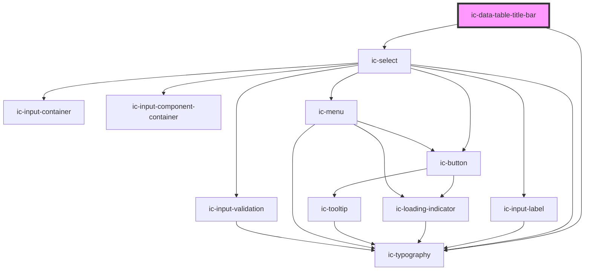

# ic-data-table-title-bar

<!-- Auto Generated Below -->

## Properties

| Property            | Attribute             | Description                                                                                                                                                        | Type      | Default                     |
| ------------------- | --------------------- | ------------------------------------------------------------------------------------------------------------------------------------------------------------------ | --------- | --------------------------- |
| `description`       | `description`         | The description that is displayed below the `heading` and `metadata`. Can be overridden with the `description` slot.                                               | `string`  | `undefined`                 |
| `heading`           | `heading`             | The heading of the title bar. Can be overridden with the `heading` slot. If used with an ic-data-table it will default to the table's `caption` unless overridden. | `string`  | `DEFAULT_TITLE_BAR_HEADING` |
| `hideDensitySelect` | `hide-density-select` | When `true`, the density select will not be rendered.                                                                                                              | `boolean` | `false`                     |
| `metadata`          | `metadata`            | The metadata displayed next to the `heading`.                                                                                                                      | `string`  | `undefined`                 |

## Events

| Event                  | Description                                             | Type                                      |
| ---------------------- | ------------------------------------------------------- | ----------------------------------------- |
| `icTableDensityUpdate` | Emitted when the table density select value is changed. | `CustomEvent<IcDensityUpdateEventDetail>` |

## Slots

| Slot               | Description                                                                                                   |
| ------------------ | ------------------------------------------------------------------------------------------------------------- |
| `"custom-actions"` | Render additional custom actions to the left of the density select.                                           |
| `"description"`    | Render an alternative description in the description section.                                                 |
| `"heading"`        | The heading to render on the data table title bar.                                                            |
| `"primary-action"` | Render an interactive element that will perform a primary action. Renders to the right of the density select. |

## Dependencies

### Depends on

- [ic-typography](../ic-typography)
- [ic-select](../ic-select)

### Graph

----------------------------------------------

