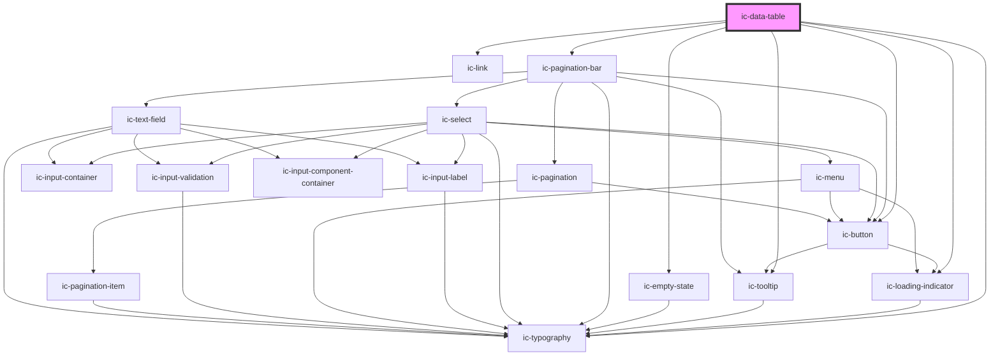

# ic-data-table

<!-- Auto Generated Below -->

## Properties

| Property                        | Attribute                          | Description                                                                                                                                                                                                                                                                                                       | Type                                                                                                                                                                                  | Default                                                                                                                                                                                                                                                                                                                                                                                                                                 |
| ------------------------------- | ---------------------------------- | ----------------------------------------------------------------------------------------------------------------------------------------------------------------------------------------------------------------------------------------------------------------------------------------------------------------- | ------------------------------------------------------------------------------------------------------------------------------------------------------------------------------------- | --------------------------------------------------------------------------------------------------------------------------------------------------------------------------------------------------------------------------------------------------------------------------------------------------------------------------------------------------------------------------------------------------------------------------------------- |
| `caption` _(required)_          | `caption`                          | The title for the table only visible to screen readers.                                                                                                                                                                                                                                                           | `string`                                                                                                                                                                              | `undefined`                                                                                                                                                                                                                                                                                                                                                                                                                             |
| `columnHeaderTruncation`        | `column-header-truncation`         | Determines whether the column header should be truncated and display a tooltip. Default is `false`.                                                                                                                                                                                                               | `boolean`                                                                                                                                                                             | `false`                                                                                                                                                                                                                                                                                                                                                                                                                                 |
| `columns` _(required)_          | --                                 | The column headers for the table.                                                                                                                                                                                                                                                                                 | `IcDataTableColumnObject[]`                                                                                                                                                           | `undefined`                                                                                                                                                                                                                                                                                                                                                                                                                             |
| `data`                          | --                                 | The row content for the table.                                                                                                                                                                                                                                                                                    | `IcDataTableDataType[]`                                                                                                                                                               | `undefined`                                                                                                                                                                                                                                                                                                                                                                                                                             |
| `density`                       | `density`                          | Set the density of the table including font and padding.                                                                                                                                                                                                                                                          | `"default" \| "dense" \| "spacious"`                                                                                                                                                  | `"default"`                                                                                                                                                                                                                                                                                                                                                                                                                             |
| `embedded`                      | `embedded`                         | Applies a border to the table container.                                                                                                                                                                                                                                                                          | `boolean`                                                                                                                                                                             | `false`                                                                                                                                                                                                                                                                                                                                                                                                                                 |
| `globalRowHeight`               | `global-row-height`                | Sets the row height on all rows in the table that aren't set using the `variableRowHeight` method.                                                                                                                                                                                                                | `"auto" \| number`                                                                                                                                                                    | `"auto"`                                                                                                                                                                                                                                                                                                                                                                                                                                |
| `height`                        | `height`                           | Sets the table height. Can be set to `auto` or a specific value in `px`, `rem`, or `%`.                                                                                                                                                                                                                           | `string`                                                                                                                                                                              | `undefined`                                                                                                                                                                                                                                                                                                                                                                                                                             |
| `hideColumnHeaders`             | `hide-column-headers`              | If `true`, column headers will not be visible.                                                                                                                                                                                                                                                                    | `boolean`                                                                                                                                                                             | `false`                                                                                                                                                                                                                                                                                                                                                                                                                                 |
| `loading`                       | `loading`                          | When set to `true`, the full table will show a loading state, featuring a radial indicator.                                                                                                                                                                                                                       | `boolean`                                                                                                                                                                             | `false`                                                                                                                                                                                                                                                                                                                                                                                                                                 |
| `loadingOptions`                | --                                 | Sets the props for the circular loading indicator used in the loading state.                                                                                                                                                                                                                                      | `{ appearance?: IcThemeForegroundNoDefault; description?: string; label?: string; labelDuration?: number; max?: number; min?: number; progress?: number; showBackground?: boolean; }` | `undefined`                                                                                                                                                                                                                                                                                                                                                                                                                             |
| `maxWidth`                      | `max-width`                        | Sets the maximum width of the data table. Can be set in `px`, `rem`, or `%`.                                                                                                                                                                                                                                      | `string`                                                                                                                                                                              | `undefined`                                                                                                                                                                                                                                                                                                                                                                                                                             |
| `minWidth`                      | `min-width`                        | Sets the minimum width of the data table. Can be set in `px`, `rem`, or `%`.                                                                                                                                                                                                                                      | `string`                                                                                                                                                                              | `undefined`                                                                                                                                                                                                                                                                                                                                                                                                                             |
| `minimumLoadingDisplayDuration` | `minimum-loading-display-duration` | The minimum amount of time the `loading` state displays for before showing the data. Used to prevent flashing in the component.                                                                                                                                                                                   | `number`                                                                                                                                                                              | `1000`                                                                                                                                                                                                                                                                                                                                                                                                                                  |
| `paginationBarOptions`          | --                                 | Sets the props for the built-in pagination bar. If the `pagination-bar` slot is used then this prop is ignored.                                                                                                                                                                                                   | `IcPaginationBarOptions`                                                                                                                                                              | `{     itemsPerPageOptions: [       { label: "10", value: "10" },       { label: "25", value: "25" },       { label: "50", value: "50" },     ],     rangeLabelType: "page",     type: "simple",     showItemsPerPageControl: true,     showGoToPageControl: true,     alignment: "right",     appearance: "default",     itemLabel: "Item",     pageLabel: "Page",     hideRangeLabel: false,     hideAllFromItemsPerPage: false,   }` |
| `showPagination`                | `show-pagination`                  | If `true`, adds a pagination bar to the bottom of the table.                                                                                                                                                                                                                                                      | `boolean`                                                                                                                                                                             | `false`                                                                                                                                                                                                                                                                                                                                                                                                                                 |
| `sortOptions`                   | --                                 | Sets the order columns will be sorted in and allows for 'default' sorts to be added.                                                                                                                                                                                                                              | `{ sortOrders: IcDataTableSortOrderOptions[]; defaultColumn?: string; }`                                                                                                              | `{     sortOrders: ["unsorted", "ascending", "descending"],     defaultColumn: "",   }`                                                                                                                                                                                                                                                                                                                                                 |
| `sortable`                      | `sortable`                         | If `true`, allows table columns to be sorted using applied sort buttons.                                                                                                                                                                                                                                          | `boolean`                                                                                                                                                                             | `false`                                                                                                                                                                                                                                                                                                                                                                                                                                 |
| `stickyColumnHeaders`           | `sticky-column-headers`            | If `true`, column headers will remain at the top of the table when scrolling vertically.                                                                                                                                                                                                                          | `boolean`                                                                                                                                                                             | `false`                                                                                                                                                                                                                                                                                                                                                                                                                                 |
| `stickyRowHeaders`              | `sticky-row-headers`               | If `true`, row headers will remain to the left when scrolling horizontally.                                                                                                                                                                                                                                       | `boolean`                                                                                                                                                                             | `false`                                                                                                                                                                                                                                                                                                                                                                                                                                 |
| `tableLayout`                   | `table-layout`                     | Sets the layout of the table                                                                                                                                                                                                                                                                                      | `"auto" \| "fixed"`                                                                                                                                                                   | `"fixed"`                                                                                                                                                                                                                                                                                                                                                                                                                               |
| `truncationPattern`             | `truncation-pattern`               | Sets the method used to truncate long text in cells where textWrap is `false`. The `tooltip` truncation pattern allows the overflowing text to be seen in a tooltip. The `show-hide` truncation pattern allows the overflowing text to be shown and hidden using the ic-typography "See more"/"See less" buttons. | `"show-hide" \| "tooltip"`                                                                                                                                                            | `undefined`                                                                                                                                                                                                                                                                                                                                                                                                                             |
| `updating`                      | `updating`                         | If `true`, the table displays a linear loading indicator below the header row to indicate an updating state.                                                                                                                                                                                                      | `boolean`                                                                                                                                                                             | `false`                                                                                                                                                                                                                                                                                                                                                                                                                                 |
| `updatingOptions`               | --                                 | Sets the props for the linear loading indicator used in the updating state.                                                                                                                                                                                                                                       | `{ appearance?: IcThemeForegroundNoDefault; description?: string; max?: number; min?: number; progress?: number; }`                                                                   | `undefined`                                                                                                                                                                                                                                                                                                                                                                                                                             |
| `variableRowHeight`             | --                                 | Allows for custom setting of row heights on individual rows based on an individual value from the `data` prop and the row index. If the function returns `null`, that row's height will be set to the `globalRowHeight` property.                                                                                 | `(params: { [key: string]: any; index: number; }) => IcDataTableRowHeights`                                                                                                           | `undefined`                                                                                                                                                                                                                                                                                                                                                                                                                             |
| `width`                         | `width`                            | Sets the table width. Can be set to `auto` or a specific value in `px`, `rem`, or `%`.                                                                                                                                                                                                                            | `string`                                                                                                                                                                              | `undefined`                                                                                                                                                                                                                                                                                                                                                                                                                             |

## Events

| Event               | Description                                                                                    | Type                             |
| ------------------- | ---------------------------------------------------------------------------------------------- | -------------------------------- |
| `icRowHeightChange` | Emitted when the `globalRowHeight` or `variableRowHeight` properties change in the data table. | `CustomEvent<void>`              |
| `icSortChange`      | Emitted when a column sort button is clicked.                                                  | `CustomEvent<IcSortEventDetail>` |

## Methods

### `resetRowHeights(rowHeight?: number | "auto") => Promise<void>`

Resets the `globalRowHeight` prop to number or auto and sets the `variableRowHeight` prop to `null`.

#### Parameters

| Name        | Type               | Description |
| ----------- | ------------------ | ----------- |
| `rowHeight` | `number \| "auto"` |             |

#### Returns

Type: `Promise<void>`

## Slots

| Slot                                | Description                                                                                                                                                                           |
| ----------------------------------- | ------------------------------------------------------------------------------------------------------------------------------------------------------------------------------------- |
| `"empty-state"`                     | Content is slotted below the table header when there is no data and the table is not loading.                                                                                         |
| `"pagination-bar"`                  | A custom ic-pagination-bar can be slotted below the data to provide enhanced control over how the data is interacted with when being fetched externally.                              |
| `"title-bar"`                       | A custom ic-data-table-title-bar can be slotted above the column headers to display additional information about the table.                                                           |
| `"{COLUMN_KEY}-column-icon"`        | The icon slot for a column header.                                                                                                                                                    |
| `"{COLUMN_KEY}-{ROW_INDEX}[-icon]"` | Each cell should have its own slot, named using the column tag and the row index, allowing for custom elements to be displayed. Include `-icon` at the end for that cell's icon slot. |

## Dependencies

### Depends on

- ic-loading-indicator
- ic-typography
- ic-link
- ic-tooltip
- ic-button
- ic-empty-state
- [ic-pagination-bar](../ic-pagination-bar)

### Graph

----------------------------------------------

