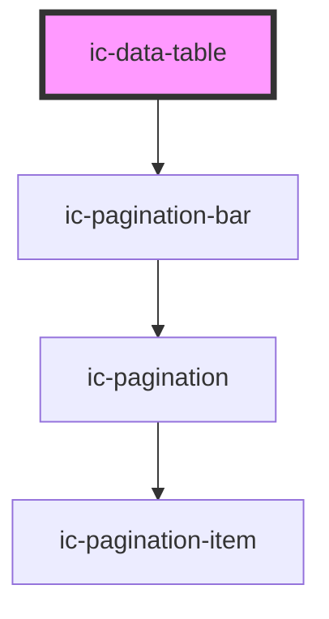

# ic-data-table

<!-- Auto Generated Below -->

## Properties

| Property               | Attribute               | Description                                                                              | Type                                                                                                                                                                                                                        | Default                                                                                                                                                                                                                                                                   |
| ---------------------- | ----------------------- | ---------------------------------------------------------------------------------------- | --------------------------------------------------------------------------------------------------------------------------------------------------------------------------------------------------------------------------- | ------------------------------------------------------------------------------------------------------------------------------------------------------------------------------------------------------------------------------------------------------------------------- |
| `caption` _(required)_ | `caption`               | The title for the table only visible to screen readers.                                  | `string`                                                                                                                                                                                                                    | `undefined`                                                                                                                                                                                                                                                               |
| `columns` _(required)_ | --                      | The column headers for the table.                                                        | `IcDataTableColumnObject[]`                                                                                                                                                                                                 | `undefined`                                                                                                                                                                                                                                                               |
| `data`                 | --                      | The row content for the table.                                                           | `{ [key: string]: any; }[]`                                                                                                                                                                                                 | `undefined`                                                                                                                                                                                                                                                               |
| `density`              | `density`               | Set the density of the table including font and padding.                                 | `"default" \| "dense" \| "spacious"`                                                                                                                                                                                        | `"default"`                                                                                                                                                                                                                                                               |
| `embedded`             | `embedded`              | Applies a border to the table container.                                                 | `boolean`                                                                                                                                                                                                                   | `false`                                                                                                                                                                                                                                                                   |
| `hideColumnHeaders`    | `hide-column-headers`   | If `true`, column headers will not be visible.                                           | `boolean`                                                                                                                                                                                                                   | `false`                                                                                                                                                                                                                                                                   |
| `paginationOptions`    | --                      | Sets the props for the pagination bar.                                                   | `{ itemsPerPage?: { label: string; value: string; }[]; type?: IcPaginationTypes; control?: IcPaginationControlTypes; itemsPerPageControl?: boolean; goToPageControl?: boolean; alignment?: IcPaginationAlignmentOptions; }` | `{     itemsPerPage: [       { label: "10", value: "10" },       { label: "25", value: "25" },       { label: "50", value: "50" },     ],     type: "page",     control: "simple",     itemsPerPageControl: true,     goToPageControl: true,     alignment: "right",   }` |
| `showPagination`       | `show-pagination`       | If `true`, adds a pagination bar to the bottom of the table.                             | `boolean`                                                                                                                                                                                                                   | `false`                                                                                                                                                                                                                                                                   |
| `sortOptions`          | --                      | Sets the order columns will be sorted in and allows for 'default' sorts to be added.     | `{ sortOrders: IcDataTableSortOrderOptions[]; defaultColumn?: string; }`                                                                                                                                                    | `{     sortOrders: ["unsorted", "ascending", "descending"],     defaultColumn: "",   }`                                                                                                                                                                                   |
| `sortable`             | `sortable`              | If `true`, allows table columns to be sorted using applied sort buttons.                 | `boolean`                                                                                                                                                                                                                   | `false`                                                                                                                                                                                                                                                                   |
| `stickyColumnHeaders`  | `sticky-column-headers` | If `true`, column headers will remain at the top of the table when scrolling vertically. | `boolean`                                                                                                                                                                                                                   | `false`                                                                                                                                                                                                                                                                   |
| `stickyRowHeaders`     | `sticky-row-headers`    | If `true`, row headers will remain to the left when scrolling horizontally.              | `boolean`                                                                                                                                                                                                                   | `false`                                                                                                                                                                                                                                                                   |

## Dependencies

### Depends on

- [ic-pagination-bar](../ic-pagination-bar)

### Graph

----------------------------------------------

