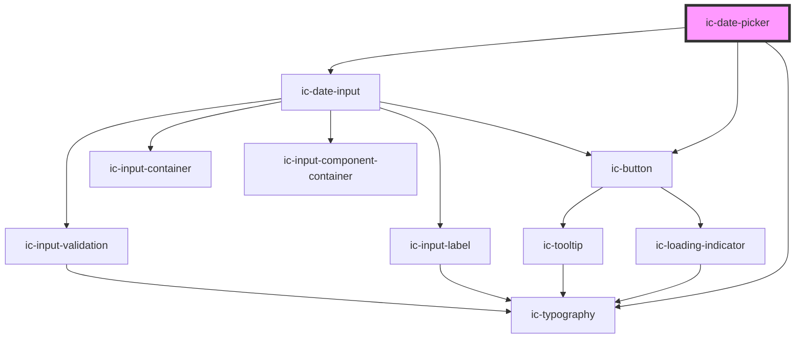

# ic-date-picker

<!-- Auto Generated Below -->

## Properties

| Property                | Attribute                  | Description                                                                                                                                                                                                                                            | Type                                                                                                                                                      | Default                                                                                                 |
| ----------------------- | -------------------------- | ------------------------------------------------------------------------------------------------------------------------------------------------------------------------------------------------------------------------------------------------------ | --------------------------------------------------------------------------------------------------------------------------------------------------------- | ------------------------------------------------------------------------------------------------------- |
| `dateFormat`            | `date-format`              | The format in which the date will be displayed.                                                                                                                                                                                                        | `"DD/MM/YYYY" \| "MM/DD/YYYY" \| "YYYY/MM/DD"`                                                                                                            | `"DD/MM/YYYY"`                                                                                          |
| `disableDays`           | --                         | The days of the week to disable.                                                                                                                                                                                                                       | `IcWeekDays[]`                                                                                                                                            | `[]`                                                                                                    |
| `disableDaysMessage`    | `disable-days-message`     | The text to display as the validation message when `disableDays` is `true` and a disabled date is entered.                                                                                                                                             | `string`                                                                                                                                                  | `"The date you have selected is on a day of the week that is not allowed. Please select another date."` |
| `disableFuture`         | `disable-future`           | If `true`, dates in the future are not allowed. A validation message will appear if a date in the future is entered.                                                                                                                                   | `boolean`                                                                                                                                                 | `false`                                                                                                 |
| `disableFutureMessage`  | `disable-future-message`   | The text to display as the validation message when `disableFuture` is `true` and a date in the future is entered.                                                                                                                                      | `string`                                                                                                                                                  | `"Dates in the future are not allowed. Please select a date in the past."`                              |
| `disablePast`           | `disable-past`             | If `true`, dates in the past are not allowed. A validation message will appear if a date in the past is entered.                                                                                                                                       | `boolean`                                                                                                                                                 | `false`                                                                                                 |
| `disablePastMessage`    | `disable-past-message`     | The text to display as the validation message when `disablePast` is `true` and a date in the past is entered.                                                                                                                                          | `string`                                                                                                                                                  | `"Dates in the past are not allowed. Please select a date in the future."`                              |
| `disabled`              | `disabled`                 | If `true`, the disabled state will be set.                                                                                                                                                                                                             | `boolean`                                                                                                                                                 | `false`                                                                                                 |
| `helperText`            | `helper-text`              | The helper text that will be displayed for additional field guidance. This will default to the text "Use format" along with the `dateFormat` value.                                                                                                    | `string`                                                                                                                                                  | `undefined`                                                                                             |
| `hideHelperText`        | `hide-helper-text`         | If `true`, the helper text will be visually hidden, but still read out by screenreaders.                                                                                                                                                               | `boolean`                                                                                                                                                 | `false`                                                                                                 |
| `inputId`               | `input-id`                 | The ID for the input field. The default will be an automatically generated value.                                                                                                                                                                      | `string`                                                                                                                                                  | `undefined`                                                                                             |
| `invalidDateMessage`    | `invalid-date-message`     | The text to display as the validation message when an invalid date is entered.                                                                                                                                                                         | `string`                                                                                                                                                  | `"Please enter a valid date."`                                                                          |
| `label` _(required)_    | `label`                    | The label for the date input.                                                                                                                                                                                                                          | `string`                                                                                                                                                  | `undefined`                                                                                             |
| `max`                   | `max`                      | The latest date that will be allowed. The value can be in any format supported as `dateFormat`, in ISO 8601 date string format (`yyyy-mm-dd`) or as a JavaScript `Date` object. The value of this prop is ignored if `disableFuture` is set to `true`. | `Date \| string`                                                                                                                                          | `""`                                                                                                    |
| `min`                   | `min`                      | The earliest date that will be allowed. The value can be in any format supported as `dateFormat`, in ISO 8601 date string format (`yyyy-mm-dd`) or as a JavaScript `Date` object. The value of this prop is ignored if `disablePast` is set to `true`. | `Date \| string`                                                                                                                                          | `""`                                                                                                    |
| `name`                  | `name`                     | The name of the control, which is submitted with the form data.                                                                                                                                                                                        | `string`                                                                                                                                                  | `undefined`                                                                                             |
| `openAtDate`            | `open-at-date`             | The date visible when the calendar opens. Used if no date is currently selected. The value can be in any format supported as `dateFormat`, in ISO 8601 date string format (`yyyy-mm-dd`) or as a JavaScript `Date` object.                             | `Date \| string`                                                                                                                                          | `""`                                                                                                    |
| `required`              | `required`                 | If `true`, the input will require a value.                                                                                                                                                                                                             | `boolean`                                                                                                                                                 | `false`                                                                                                 |
| `showDaysOutsideMonth`  | `show-days-outside-month`  | If `true`, days outside the current month will be visible in the date picker.                                                                                                                                                                          | `boolean`                                                                                                                                                 | `true`                                                                                                  |
| `showPickerClearButton` | `show-picker-clear-button` | If `true`, the `Clear` button on the date picker will be visible.                                                                                                                                                                                      | `boolean`                                                                                                                                                 | `true`                                                                                                  |
| `showPickerTodayButton` | `show-picker-today-button` | If `true`, the `Go to today` button on the date picker will be visible.                                                                                                                                                                                | `boolean`                                                                                                                                                 | `true`                                                                                                  |
| `size`                  | `size`                     | The size of the date picker to be displayed.                                                                                                                                                                                                           | `"default" \| "large" \| "small"`                                                                                                                         | `"default"`                                                                                             |
| `startOfWeek`           | `start-of-week`            | The first day of the week. `0` for Sunday, `1` for Monday, etc. Default is Monday.                                                                                                                                                                     | `IcWeekDays.Friday \| IcWeekDays.Monday \| IcWeekDays.Saturday \| IcWeekDays.Sunday \| IcWeekDays.Thursday \| IcWeekDays.Tuesday \| IcWeekDays.Wednesday` | `IcWeekDays.Monday`                                                                                     |
| `validationStatus`      | `validation-status`        | The validation status - e.g. 'error' \| 'warning' \| 'success'. This will override the built-in date validation.                                                                                                                                       | `"" \| "error" \| "success" \| "warning"`                                                                                                                 | `""`                                                                                                    |
| `validationText`        | `validation-text`          | The text to display as the validation message. This will override the built-in date validation.                                                                                                                                                        | `string`                                                                                                                                                  | `""`                                                                                                    |
| `value`                 | `value`                    | The value of the date picker. The value can be in any format supported as `dateFormat`, in ISO 8601 date string format (`yyyy-mm-dd`) or as a JavaScript `Date` object.                                                                                | `Date \| string`                                                                                                                                          | `""`                                                                                                    |

## Events

| Event      | Description                         | Type                            |
| ---------- | ----------------------------------- | ------------------------------- |
| `icChange` | Emitted when the value has changed. | `CustomEvent<{ value: Date; }>` |

## CSS Custom Properties

| Name                       | Description              |
| -------------------------- | ------------------------ |
| `--ic-z-index-date-picker` | z-index of date picker.  |
| `--input-width`            | Width of the input field |

## Dependencies

### Depends on

- ic-button
- [ic-date-input](../ic-date-input)
- ic-typography

### Graph

----------------------------------------------

