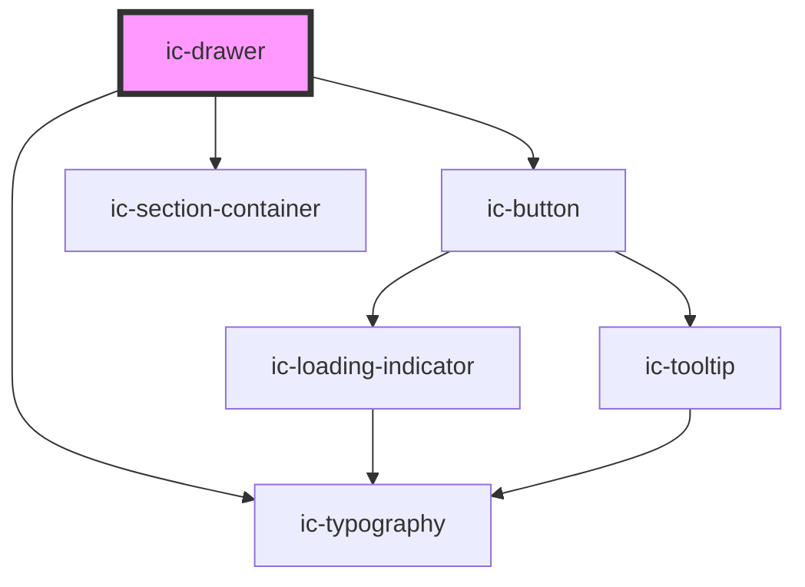

# ic-drawer

<!-- Auto Generated Below -->

## Properties

| Property                 | Attribute                   | Description                                                                                                                                                                                         | Type                                     | Default          |
| ------------------------ | --------------------------- | --------------------------------------------------------------------------------------------------------------------------------------------------------------------------------------------------- | ---------------------------------------- | ---------------- |
| `ariaLabel`              | `aria-label`                | The aria label applied to the drawer. This is required when the heading slot is used.                                                                                                               | `string`                                 | `""`             |
| `chevronButtonAriaLabel` | `chevron-button-aria-label` | The aria label of the chevron button when trigger is set to "arrow". The default aria label is "Open drawer" / "Close drawer".                                                                      | `string`                                 | `""`             |
| `closeButtonAriaLabel`   | `close-button-aria-label`   | The aria label of the close button when the show-close-button attribute (web-components) / showCloseButton prop (React) is set to `true`. The default aria label is "Open drawer" / "Close drawer". | `string`                                 | `"Close drawer"` |
| `closeOnBackdropClick`   | `close-on-backdrop-click`   | If set to `false`, the drawer will not close when the backdrop is clicked.                                                                                                                          | `boolean`                                | `true`           |
| `expanded`               | `expanded`                  | If set to `true`, the drawer will display in an expanded state.                                                                                                                                     | `boolean`                                | `false`          |
| `heading`                | `heading`                   | The heading to render in the drawer.                                                                                                                                                                | `string`                                 | `undefined`      |
| `message`                | `message`                   | The main body text in the drawer.                                                                                                                                                                   | `string`                                 | `undefined`      |
| `position`               | `position`                  | The position of the drawer.                                                                                                                                                                         | `"bottom" \| "left" \| "right" \| "top"` | `"right"`        |
| `showCloseButton`        | `show-close-button`         | If set to `true`, an X (close) button will be displayed in the drawer.                                                                                                                              | `boolean`                                | `false`          |
| `size`                   | `size`                      | The size of the expanded drawer.                                                                                                                                                                    | `"large" \| "medium" \| "small"`         | `"medium"`       |
| `trigger`                | `trigger`                   | The method in which the drawer is expanded.                                                                                                                                                         | `"arrow" \| "controlled"`                | `"arrow"`        |
| `variant`                | `variant`                   | The variant of the drawer. TODO - figure out how this works                                                                                                                                         | `"persistent" \| "temporary"`            | `"temporary"`    |

## Events

| Event              | Description                                        | Type                                  |
| ------------------ | -------------------------------------------------- | ------------------------------------- |
| `icDrawerExpanded` | Emitted when the drawer is collapsed and expanded. | `CustomEvent<IcDrawerExpandedDetail>` |

## Slots

| Slot                  | Description                                                              |
| --------------------- | ------------------------------------------------------------------------ |
| `"actions"`           | Content will be rendered in the action area, adjacent to the title area. |
| `"heading"`           | Content will be rendered in the title area, in place of the heading.     |
| `"heading-adornment"` | Content will be rendered in the title area, to the left of the heading.  |
| `"message"`           | Content will be rendered below the title area, in place of the message.  |

## CSS Custom Properties

| Name                  | Description                                     |
| --------------------- | ----------------------------------------------- |
| `--ic-drawer-height`  | the width of the expanded top or bottom drawer. |
| `--ic-drawer-width`   | the width of the expanded left or right drawer. |
| `--ic-z-index-drawer` | z-index of drawer.                              |

## Dependencies

### Depends on

- ic-button
- ic-section-container
- ic-typography

### Graph

----------------------------------------------

