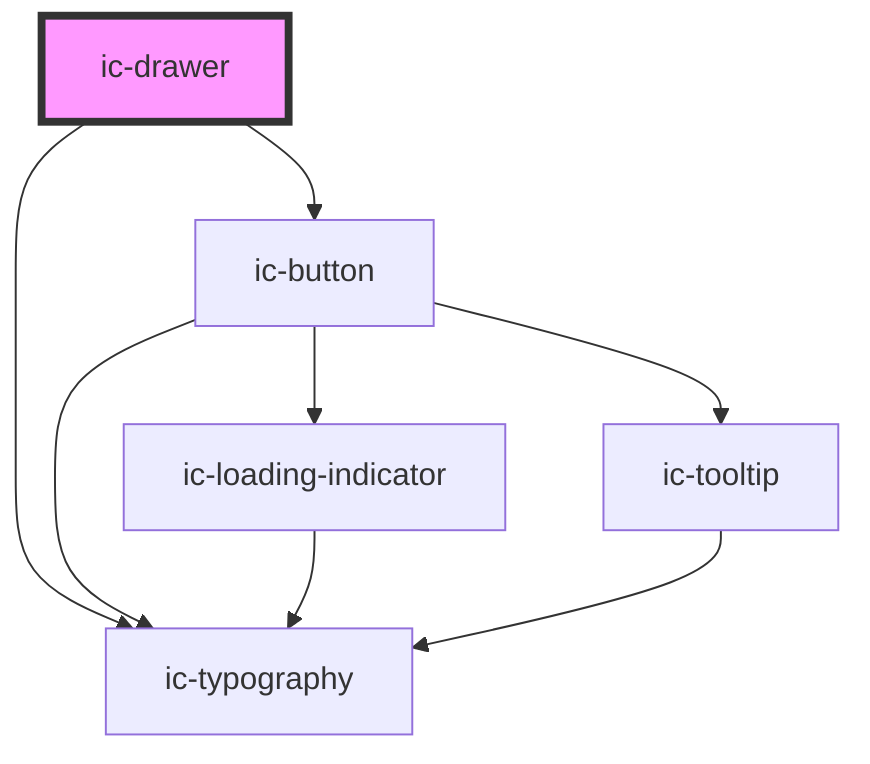

# ic-drawer

<!-- Auto Generated Below -->

## Properties

| Property                 | Attribute                   | Description                                                                                                                                                 | Type                                     | Default      |
| ------------------------ | --------------------------- | ----------------------------------------------------------------------------------------------------------------------------------------------------------- | ---------------------------------------- | ------------ |
| `ariaLabel`              | `aria-label`                | The aria label applied to the drawer. This is required when the heading slot is used.                                                                       | `string`                                 | `""`         |
| `boundary`               | `boundary`                  | The area within which the drawer should be contained. When set to "parent", the value of the parent element's `position` CSS property must not be "static". | `"parent" \| "viewport"`                 | `"viewport"` |
| `chevronButtonAriaLabel` | `chevron-button-aria-label` | The aria-label of the chevron button (displayed when `trigger="arrow"`). This will default to "Open drawer" / "Close drawer".                               | `string \| undefined`                    | `undefined`  |
| `closeButtonAriaLabel`   | `close-button-aria-label`   | The aria-label of the close button (displayed when `trigger="controlled"`). This will default to "Close drawer".                                            | `string \| undefined`                    | `undefined`  |
| `closeOnBackdropClick`   | `close-on-backdrop-click`   | If `true`, the drawer will close when the backdrop is clicked.                                                                                              | `boolean`                                | `true`       |
| `expanded`               | `expanded`                  | If `true`, the drawer will display in an expanded state.                                                                                                    | `boolean`                                | `false`      |
| `heading`                | `heading`                   | The heading of the drawer. This is required, unless a slotted heading is used.                                                                              | `string \| undefined`                    | `undefined`  |
| `hideCloseButton`        | `hide-close-button`         | If set to `true`, the X (close) button which is displayed when `trigger` is set to "controlled" will be hidden.                                             | `boolean`                                | `false`      |
| `message`                | `message`                   | The body content of the drawer.                                                                                                                             | `string \| undefined`                    | `undefined`  |
| `position`               | `position`                  | The position of the drawer.                                                                                                                                 | `"bottom" \| "left" \| "right" \| "top"` | `"right"`    |
| `size`                   | `size`                      | The size of the expanded drawer.                                                                                                                            | `"large" \| "medium" \| "small"`         | `"medium"`   |
| `theme`                  | `theme`                     | Sets the drawer to the dark or light theme colors. "inherit" will set the color based on the system settings or ic-theme component.                         | `"dark" \| "inherit" \| "light"`         | `"inherit"`  |
| `trigger`                | `trigger`                   | The method in which the drawer is expanded.                                                                                                                 | `"arrow" \| "controlled"`                | `"arrow"`    |

## Events

| Event              | Description                                        | Type                                  |
| ------------------ | -------------------------------------------------- | ------------------------------------- |
| `icDrawerExpanded` | Emitted when the drawer is collapsed and expanded. | `CustomEvent<IcDrawerExpandedDetail>` |

## Slots

| Slot                  | Description                                                              |
| --------------------- | ------------------------------------------------------------------------ |
| `"actions"`           | Content will be rendered in the action area, adjacent to the title area. |
| `"heading"`           | Content will be rendered in the title area, in place of the heading.     |
| `"heading-adornment"` | Content will be rendered in the title area, to the left of the heading.  |

## Dependencies

### Depends on

- ic-button
- ic-typography

### Graph

----------------------------------------------

