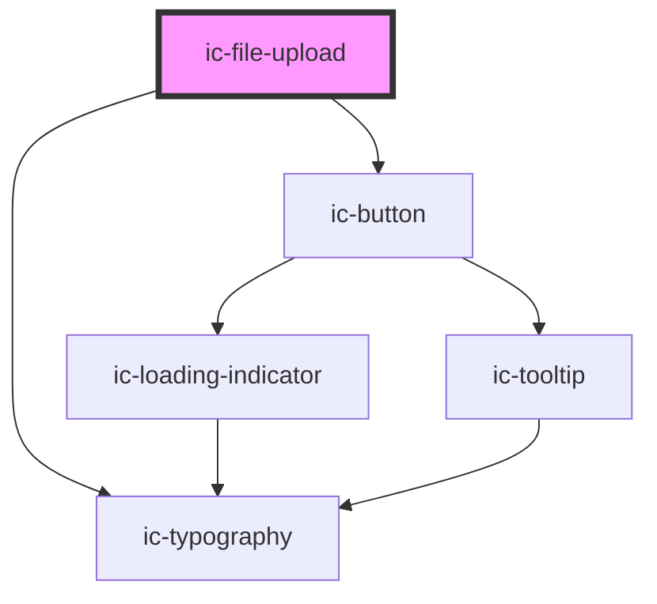

# ic-file-upload

<!-- Auto Generated Below -->

## Properties

| Property        | Attribute         | Description                                                                        | Type      | Default                      |
| --------------- | ----------------- | ---------------------------------------------------------------------------------- | --------- | ---------------------------- |
| `accept`        | `accept`          | This is the accepted list of file types.                                           | `string`  | `"*"`                        |
| `fileInputName` | `file-input-name` | The name of the control for the file input, which is submitted with the form data. | `string`  | ``file-upload-internal``     |
| `fitContainer`  | `fit-container`   | If `true`, the file upload component will fit the size of the container.           | `boolean` | `true`                       |
| `multiple`      | `multiple`        | This boolean determines whether multiple files are accepted.                       | `boolean` | `false`                      |
| `uploadText`    | `upload-text`     | The text displayed between the browse button and the upload icon.                  | `string`  | `'Drag and drop files here'` |

## Events

| Event      | Description | Type                  |
| ---------- | ----------- | --------------------- |
| `onUpload` |             | `CustomEvent<File[]>` |

## Dependencies

### Depends on

- ic-typography
- ic-button

### Graph

----------------------------------------------

