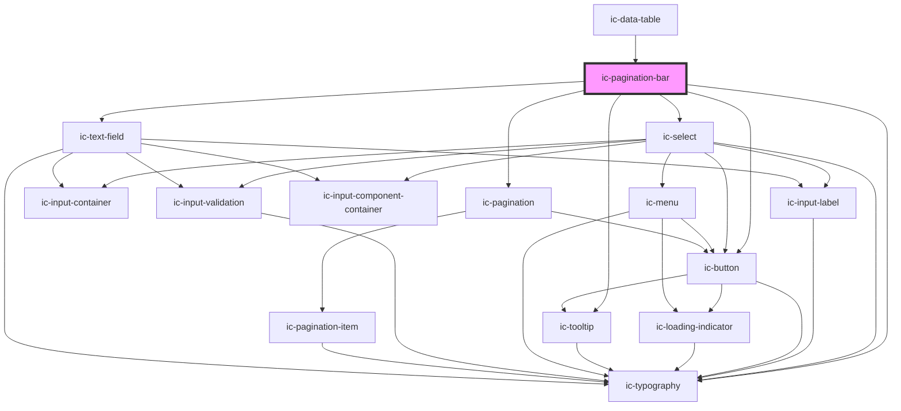

# ic-pagination-bar

<!-- Auto Generated Below -->

## Properties

| Property                           | Attribute                                | Description                                                                                                                             | Type                                                | Default                   |
| ---------------------------------- | ---------------------------------------- | --------------------------------------------------------------------------------------------------------------------------------------- | --------------------------------------------------- | ------------------------- |
| `accessibleLabel`                  | `accessible-label`                       | The accessible label passed down to the pagination component to provide context for screen reader users.                                | `string \| undefined`                               | `"Pagination Navigation"` |
| `alignment`                        | `alignment`                              | Sets the alignment of the items in the pagination bar.                                                                                  | `"left" \| "right" \| "space-between" \| undefined` | `"right"`                 |
| `currentPage`                      | `current-page`                           | The current page number to be displayed on the pagination bar.                                                                          | `number \| undefined`                               | `1`                       |
| `hideAllFromItemsPerPage`          | `hide-all-from-items-per-page`           | If `true`, the 'All' option will be hidden from the 'items per page' select input.                                                      | `boolean \| undefined`                              | `false`                   |
| `hideCurrentPage`                  | `hide-current-page`                      | If `true`, the current page of the simple pagination will not be displayed.                                                             | `boolean \| undefined`                              | `false`                   |
| `hideFirstAndLastPageButton`       | `hide-first-and-last-page-button`        | If `true`, the first and last page buttons will not be displayed.                                                                       | `boolean \| undefined`                              | `false`                   |
| `hideRangeLabel`                   | `hide-range-label`                       | If `true`, the number of total items and current item range or number of total pages and current page will be hidden.                   | `boolean \| undefined`                              | `false`                   |
| `itemLabel`                        | `item-label`                             | The text which will be used in place of 'Item' on the pagination bar.                                                                   | `string \| undefined`                               | `"Item"`                  |
| `itemsPerPageOptions`              | --                                       | The options which will be displayed for 'items per page' select input.                                                                  | `undefined \| { label: string; value: string; }[]`  | `undefined`               |
| `monochrome`                       | `monochrome`                             | If `true`, the pagination bar will display as black in the light theme, and white in dark theme.                                        | `boolean \| undefined`                              | `false`                   |
| `pageLabel`                        | `page-label`                             | The text which will be used in place of 'Page' on the pagination bar.                                                                   | `string \| undefined`                               | `"Page"`                  |
| `rangeLabelType`                   | `range-label-type`                       | Whether total number of items and current item range or total number of pages and current page is displayed.                            | `"data" \| "page" \| undefined`                     | `"page"`                  |
| `selectItemsPerPageOnEnter`        | `select-items-per-page-on-enter`         | If `false`, the value in the items per page control will be set immediately on ArrowUp and ArrowDown instead of when Enter is pressed.  | `boolean`                                           | `true`                    |
| `selectedItemsPerPage`             | `selected-items-per-page`                | The items per page option to be selected.                                                                                               | `number \| undefined`                               | `undefined`               |
| `setToFirstPageOnPaginationChange` | `set-to-first-page-on-pagination-change` | If `true`, the pagination bar is set to the first page when the 'items per page' changes                                                | `boolean \| undefined`                              | `false`                   |
| `showGoToPageControl`              | `show-go-to-page-control`                | If `true`, the 'go to page' control should be displayed.                                                                                | `boolean \| undefined`                              | `false`                   |
| `showItemsPerPageControl`          | `show-items-per-page-control`            | If `true`, the select input to control 'items per page' should be displayed.                                                            | `boolean \| undefined`                              | `false`                   |
| `theme`                            | `theme`                                  | Sets the theme color to the dark or light theme color. "inherit" will set the color based on the system settings or ic-theme component. | `"dark" \| "inherit" \| "light" \| undefined`       | `"inherit"`               |
| `totalItems` _(required)_          | `total-items`                            | Total number of items to be displayed across all pages.                                                                                 | `number`                                            | `undefined`               |
| `type`                             | `type`                                   | Whether the displayed pagination is simple or complex.                                                                                  | `"complex" \| "simple" \| undefined`                | `"simple"`                |

## Events

| Event                  | Description                                                                                                                                                                                                                                       | Type                                           |
| ---------------------- | ------------------------------------------------------------------------------------------------------------------------------------------------------------------------------------------------------------------------------------------------- | ---------------------------------------------- |
| `icItemsPerPageChange` | Emitted when the items per page option is changed.                                                                                                                                                                                                | `CustomEvent<IcItemsPerPageChangeEventDetail>` |
| `icPageChange`         | Emitted when a page is navigated to via the 'go to' input. The `detail` property contains `value` (i.e. the page number) and a `fromItemsPerPage` flag to indicate if the event was triggered by the `icItemsPerPageChange` event also occurring. | `CustomEvent<IcPageChangeEventDetail>`         |

## Dependencies

### Used by

 - [ic-data-table](../ic-data-table)

### Depends on

- ic-typography
- ic-select
- ic-pagination
- ic-tooltip
- ic-text-field
- ic-button

### Graph

----------------------------------------------

