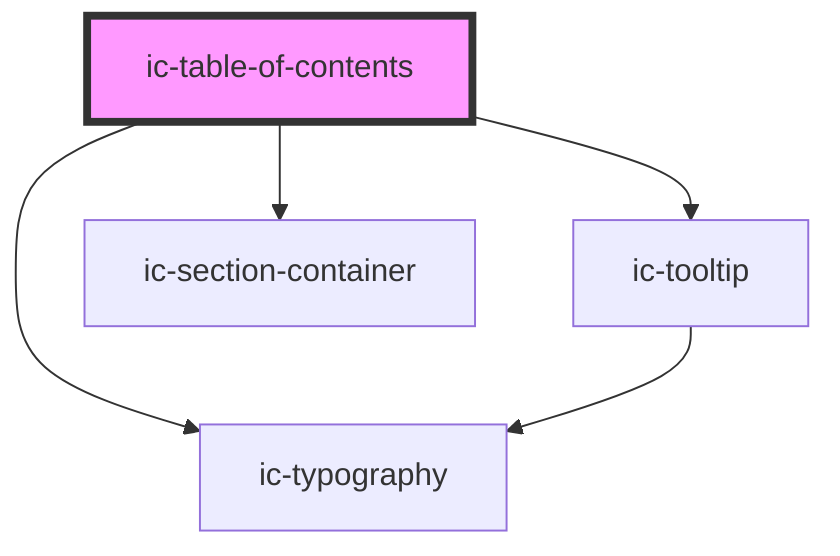

# ic-table-of-contents

<!-- Auto Generated Below -->

## Properties

| Property              | Attribute               | Description                                                                                                                                                  | Type                                          | Default      |
| --------------------- | ----------------------- | ------------------------------------------------------------------------------------------------------------------------------------------------------------ | --------------------------------------------- | ------------ |
| `heading`             | `heading`               | Heading text of the table of contents.                                                                                                                       | `string`                                      | `"Contents"` |
| `maximumHeadingLevel` | `maximum-heading-level` | Maximum heading level of child content that will generate an item in the table of contents. E.g. when set to '3', headings of <h4> and <h5> will not appear. | `number`                                      | `3`          |
| `monochrome`          | `monochrome`            | If `true`, the table of contents will display as black in the light theme, and white in dark theme.                                                          | `boolean \| undefined`                        | `false`      |
| `position`            | `position`              | Whether the table of contents will appear on the right of or above child content on large viewport widths.                                                   | `"right" \| "top"`                            | `"right"`    |
| `setScrollHeight`     | `set-scroll-height`     | Vertical offset to page scroll (in percent) when table of contents item is selected, to account for other page components like headers.                      | `number`                                      | `50`         |
| `size`                | `size`                  | The size of the table of contents items.                                                                                                                     | `"large" \| "medium" \| "small"`              | `"medium"`   |
| `theme`               | `theme`                 | Sets the theme color to the dark or light theme color. "inherit" will set the color based on the system settings or ic-theme component.                      | `"dark" \| "inherit" \| "light" \| undefined` | `"inherit"`  |
| `truncate`            | `truncate`              | If `true`, the table of contents item label will be truncated.                                                                                               | `boolean`                                     | `true`       |

## Dependencies

### Depends on

- ic-tooltip
- ic-section-container
- ic-typography

### Graph

----------------------------------------------

