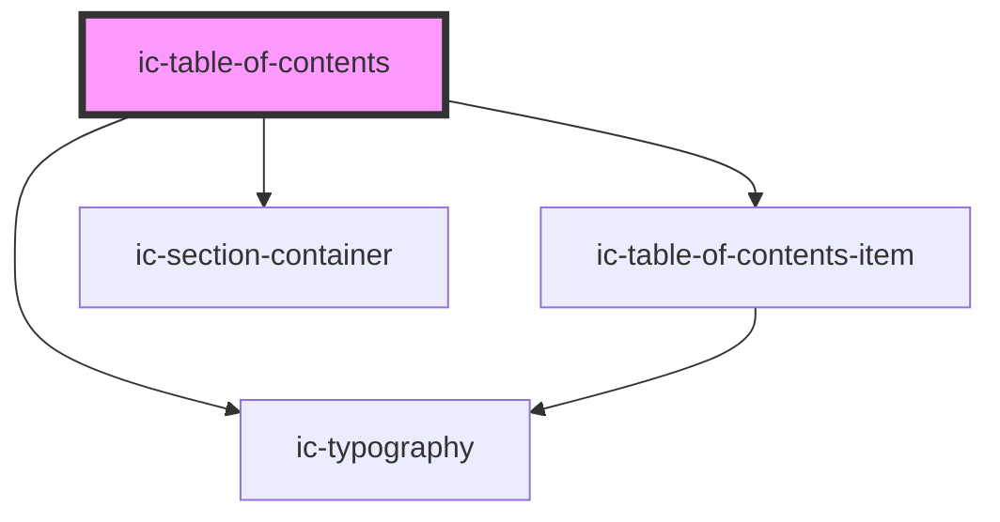

# ic-table-of-contents

<!-- Auto Generated Below -->

## Properties

| Property   | Attribute  | Description | Type                                     | Default               |
| ---------- | ---------- | ----------- | ---------------------------------------- | --------------------- |
| `heading`  | `heading`  |             | `string`                                 | `"Table of Contents"` |
| `position` | `position` |             | `"bottom" \| "left" \| "right" \| "top"` | `"right"`             |
| `size`     | `size`     |             | `"large" \| "medium" \| "small"`         | `"medium"`            |
| `theme`    | `theme`    |             | `"dark" \| "inherit" \| "light"`         | `"inherit"`           |

## Dependencies

### Depends on

- [ic-table-of-contents-item](../ic-table-of-contents-item)
- ic-section-container
- ic-typography

### Graph

```mermaid
graph TD;
  ic-table-of-contents --> ic-table-of-contents-item
  ic-table-of-contents --> ic-section-container
  ic-table-of-contents --> ic-typography
  ic-table-of-contents-item --> ic-typography
  style ic-table-of-contents fill:#f9f,stroke:#333,stroke-width:4px
```

----------------------------------------------

