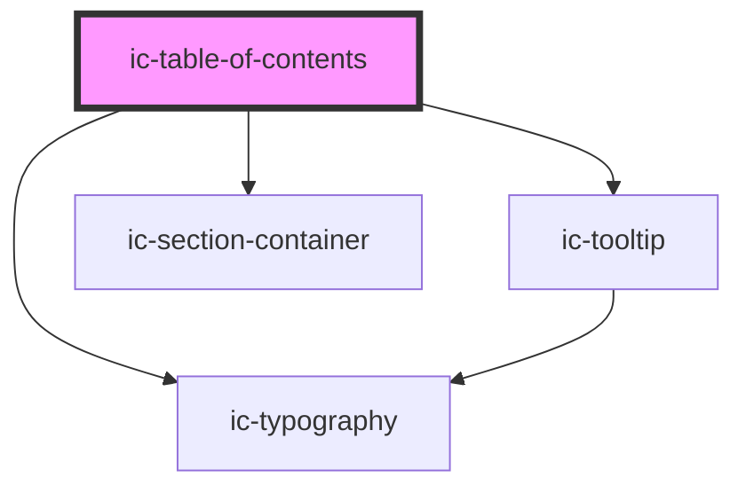

# ic-table-of-contents

<!-- Auto Generated Below -->

## Properties

| Property              | Attribute               | Description | Type                                          | Default               |
| --------------------- | ----------------------- | ----------- | --------------------------------------------- | --------------------- |
| `heading`             | `heading`               |             | `string`                                      | `"Table of Contents"` |
| `maximumHeadingLevel` | `maximum-heading-level` |             | `number`                                      | `3`                   |
| `monochrome`          | `monochrome`            |             | `boolean \| undefined`                        | `false`               |
| `position`            | `position`              |             | `"right" \| "top"`                            | `"right"`             |
| `setClickHeight`      | `set-click-height`      |             | `number`                                      | `75`                  |
| `setScrollHeight`     | `set-scroll-height`     |             | `number`                                      | `50`                  |
| `size`                | `size`                  |             | `"large" \| "medium" \| "small"`              | `"medium"`            |
| `theme`               | `theme`                 |             | `"dark" \| "inherit" \| "light" \| undefined` | `"inherit"`           |
| `truncate`            | `truncate`              |             | `boolean`                                     | `true`                |

## Dependencies

### Depends on

- ic-tooltip
- ic-section-container
- ic-typography

### Graph

```mermaid
graph TD;
  ic-table-of-contents --> ic-tooltip
  ic-table-of-contents --> ic-section-container
  ic-table-of-contents --> ic-typography
  ic-tooltip --> ic-typography
  style ic-table-of-contents fill:#f9f,stroke:#333,stroke-width:4px
```

----------------------------------------------

