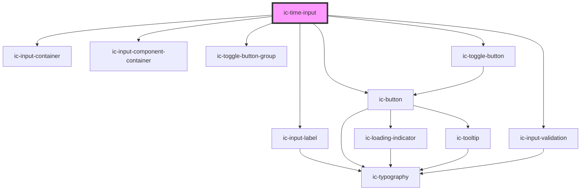

# ic-date-input

<!-- Auto Generated Below -->

## Properties

| Property             | Attribute               | Description                                                                                                                                                                                        | Type                                          | Default                             |
| -------------------- | ----------------------- | -------------------------------------------------------------------------------------------------------------------------------------------------------------------------------------------------- | --------------------------------------------- | ----------------------------------- |
| `disableTimes`       | --                      | An array of times that will be disabled in the time input. The times can be in any format supported as `timeFormat`, in ISO 8601 time string format (`HH:MM:SS`) or as a JavaScript `Date` object. | `IcDisableTimeSelection[]`                    | `[]`                                |
| `disabled`           | `disabled`              | If `true`, the disabled state will be set.                                                                                                                                                         | `boolean`                                     | `false`                             |
| `emitTimePartChange` | `emit-time-part-change` | If `true`, every individual input field completed will emit an icTimeChange event.                                                                                                                 | `boolean \| undefined`                        | `false`                             |
| `helperText`         | `helper-text`           | The helper text that will be displayed for additional field guidance. This will default to the text "Use format" along with the `timeFormat` value.                                                | `null \| string`                              | `undefined`                         |
| `hideHelperText`     | `hide-helper-text`      | If `true`, the helper text will be visually hidden, but still read out by screenreaders.                                                                                                           | `boolean`                                     | `false`                             |
| `hideLabel`          | `hide-label`            | If `true`, the label will be visually hidden, but will still be read out by screen readers.                                                                                                        | `boolean \| undefined`                        | `false`                             |
| `inputId`            | `input-id`              | The ID for the input.                                                                                                                                                                              | `string`                                      | `` `ic-time-input-${inputIds++}` `` |
| `invalidTimeMessage` | `invalid-time-message`  | The text to display as the validation message when an invalid time is entered.                                                                                                                     | `string`                                      | `"Please enter a valid time."`      |
| `label` _(required)_ | `label`                 | The label for the time input.                                                                                                                                                                      | `string`                                      | `undefined`                         |
| `max`                | `max`                   | The latest time that will be allowed. The value can be in any format supported as `timeFormat`, in ISO 8601 time string format (`HH:MM:SS`) or as a JavaScript `Date` object.                      | `Date \| string`                              | `""`                                |
| `min`                | `min`                   | The earliest time that will be allowed. The value can be in any format supported as `timeFormat`, in ISO 8601 time string format (`HH:MM:SS`) or as a JavaScript `Date` object.                    | `Date \| string`                              | `""`                                |
| `name`               | `name`                  | The name of the control, which is submitted with the form data.                                                                                                                                    | `string`                                      | `this.inputId`                      |
| `required`           | `required`              | If `true`, the input will require a value.                                                                                                                                                         | `boolean`                                     | `false`                             |
| `showAmPmToggle`     | `show-am-pm-toggle`     | If `true`, the time input will show an AM/PM toggle when in 12-hour time period.                                                                                                                   | `boolean \| undefined`                        | `false`                             |
| `showClearButton`    | `show-clear-button`     | If `true`, a button which clears the time input when clicked will be displayed.                                                                                                                    | `boolean \| undefined`                        | `true`                              |
| `size`               | `size`                  | The size of the time input to be displayed.                                                                                                                                                        | `"large" \| "medium" \| "small"`              | `"medium"`                          |
| `theme`              | `theme`                 | Sets the time picker to the dark or light theme colors. "inherit" will set the color based on the system settings or ic-theme component.                                                           | `"dark" \| "inherit" \| "light" \| undefined` | `"inherit"`                         |
| `timeFormat`         | `time-format`           | The format in which the time will be displayed.                                                                                                                                                    | `"HH:MM" \| "HH:MM:SS" \| "HH:MM:SS.SSS"`     | `this.DEFAULT_TIME_FORMAT`          |
| `timePeriod`         | `time-period`           | The time period format: "12" for 12-hour, "24" for 24-hour. Defaults to "24".                                                                                                                      | `"12" \| "24"`                                | `"24"`                              |
| `validationAriaLive` | `validation-aria-live`  | The value of the `aria-live` attribute on the validation message.                                                                                                                                  | `"assertive" \| "off" \| "polite"`            | `"polite"`                          |
| `validationStatus`   | `validation-status`     | The validation status - e.g. 'error' \| 'warning' \| 'success'. This will override the built-in time validation.                                                                                   | `"" \| "error" \| "success" \| "warning"`     | `""`                                |
| `validationText`     | `validation-text`       | The text to display as the validation message. This will override the built-in time validation.                                                                                                    | `string \| undefined`                         | `""`                                |
| `value`              | `value`                 | The value of the time input. The value can be in any format supported as `timeFormat`, in ISO 8601 time string format (`HH:MM:SS`) or as a JavaScript `Date` object.                               | `Date \| null \| string \| undefined`         | `""`                                |

## Events

| Event          | Description                         | Type                                                                                                                                                                                |
| -------------- | ----------------------------------- | ----------------------------------------------------------------------------------------------------------------------------------------------------------------------------------- |
| `icBlur`       | Emitted when the input loses focus. | `CustomEvent<{ value: Date \| null; }>`                                                                                                                                             |
| `icFocus`      | Emitted when the input gains focus. | `CustomEvent<{ value: Date \| null; }>`                                                                                                                                             |
| `icTimeChange` | Emitted when the value has changed. | `CustomEvent<{ value: Date \| null; timeObject: { hour: string \| null; minute: string \| null; second: string \| null; millisecond: string \| null; period: string \| null; }; }>` |

## Methods

### `getTime() => Promise<Date | null>`

Returns the value as a Date object

#### Returns

Type: `Promise<Date | null>`

Date

## Slots

| Slot            | Description                                           |
| --------------- | ----------------------------------------------------- |
| `"helper-text"` | Content is set as the helper text for the time input. |

## Dependencies

### Depends on

- ic-input-container
- ic-input-label
- ic-input-component-container
- ic-button
- ic-toggle-button-group
- ic-toggle-button
- ic-input-validation

### Graph

----------------------------------------------

