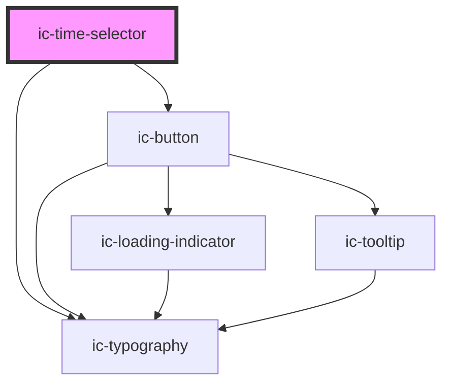

# ic-time-selector

<!-- Auto Generated Below -->

## Properties

| Property       | Attribute     | Description                                                                                                                                                                                           | Type                                          | Default                    |
| -------------- | ------------- | ----------------------------------------------------------------------------------------------------------------------------------------------------------------------------------------------------- | --------------------------------------------- | -------------------------- |
| `disableTimes` | --            | An array of times that will be disabled in the time selector. The times can be in any format supported as `timeFormat`, in ISO 8601 time string format (`HH:MM:SS`) or as a JavaScript `Date` object. | `IcDisableTimeSelection[]`                    | `[]`                       |
| `max`          | `max`         | The latest time that will be allowed. The value can be in any format supported as `timeFormat`, in ISO 8601 time string format (`HH:MM:SS`) or as a JavaScript `Date` object.                         | `Date \| string`                              | `""`                       |
| `min`          | `min`         | The earliest time that will be allowed. The value can be in any format supported as `timeFormat`, in ISO 8601 time string format (`HH:MM:SS`) or as a JavaScript `Date` object.                       | `Date \| string`                              | `""`                       |
| `size`         | `size`        | The size of the time selector to be displayed.                                                                                                                                                        | `"large" \| "medium" \| "small"`              | `"medium"`                 |
| `theme`        | `theme`       | Sets the theme color to the dark or light theme color. "inherit" will set the color based on the system settings or ic-theme component.                                                               | `"dark" \| "inherit" \| "light" \| undefined` | `"inherit"`                |
| `timeFormat`   | `time-format` | The format in which the time will be displayed.                                                                                                                                                       | `"HH:MM" \| "HH:MM:SS"`                       | `this.DEFAULT_TIME_FORMAT` |
| `timePeriod`   | `time-period` | The time period format: "12" for 12-hour, "24" for 24-hour. Defaults to "24".                                                                                                                         | `"12" \| "24"`                                | `"24"`                     |
| `value`        | `value`       | The value of the time selector. The value can be in any format supported as `timeFormat`, in ISO 8601 time string format (`HH:MM:SS`) or as a JavaScript `Date` object.                               | `Date \| null \| string \| undefined`         | `""`                       |

## Events

| Event      | Description                         | Type                                                                                                                                                                                            |
| ---------- | ----------------------------------- | ----------------------------------------------------------------------------------------------------------------------------------------------------------------------------------------------- |
| `icChange` | Emitted when the value has changed. | `CustomEvent<{ value: Date \| null; timeString: string \| null; timeObject: { hour: string \| null; minute: string \| null; second: string \| null; period?: IcTimePeriods \| undefined; }; }>` |

## Dependencies

### Depends on

- ic-typography
- ic-button

### Graph

----------------------------------------------

