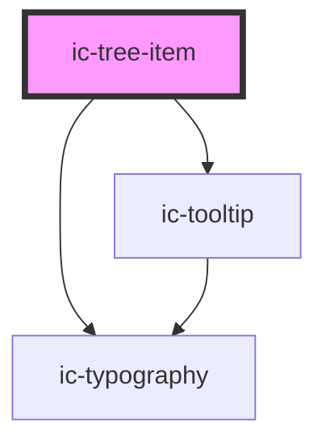

# ic-tree-item

<!-- Auto Generated Below -->

## Properties

| Property         | Attribute        | Description                                                                                                                    | Type                                                                                                                                                                                     | Default     |
| ---------------- | ---------------- | ------------------------------------------------------------------------------------------------------------------------------ | ---------------------------------------------------------------------------------------------------------------------------------------------------------------------------------------- | ----------- |
| `disabled`       | `disabled`       | If `true`, the tree item appears in the disabled state.                                                                        | `boolean`                                                                                                                                                                                | `false`     |
| `href`           | `href`           | The URL that the tree item link points to. If set, the tree item will render as an "a" tag, otherwise it will render as a div. | `string`                                                                                                                                                                                 | `undefined` |
| `hreflang`       | `hreflang`       | The human language of the linked URL.                                                                                          | `string`                                                                                                                                                                                 | `""`        |
| `label`          | `label`          | The label of the tree item.                                                                                                    | `string`                                                                                                                                                                                 | `""`        |
| `referrerpolicy` | `referrerpolicy` | How much of the referrer to send when following the link.                                                                      | `"" \| "no-referrer" \| "no-referrer-when-downgrade" \| "origin" \| "origin-when-cross-origin" \| "same-origin" \| "strict-origin" \| "strict-origin-when-cross-origin" \| "unsafe-url"` | `undefined` |
| `rel`            | `rel`            | The relationship of the linked URL as space-separated link types.                                                              | `string`                                                                                                                                                                                 | `undefined` |
| `selected`       | `selected`       | If `true`, the tree item appears in the selected state.                                                                        | `boolean`                                                                                                                                                                                | `false`     |
| `target`         | `target`         | The place to display the linked URL, as the name for a browsing context (a tab, window, or iframe).                            | `string`                                                                                                                                                                                 | `undefined` |

## Events

| Event                | Description                         | Type                           |
| -------------------- | ----------------------------------- | ------------------------------ |
| `icTreeItemSelected` | Emitted when tree item is selected. | `CustomEvent<{ id: string; }>` |

## Methods

### `setFocus() => Promise<void>`

Sets focus on the native `input`.

#### Returns

Type: `Promise<void>`

## Slots

| Slot            | Description                                         |
| --------------- | --------------------------------------------------- |
| `"icon"`        | Content is placed to the left of the label.         |
| `"label"`       | Content is set as the tree item label.              |
| `"router-item"` | Handle routing by nesting your routes in this slot. |

## Dependencies

### Depends on

- ic-tooltip
- ic-typography

### Graph

----------------------------------------------

