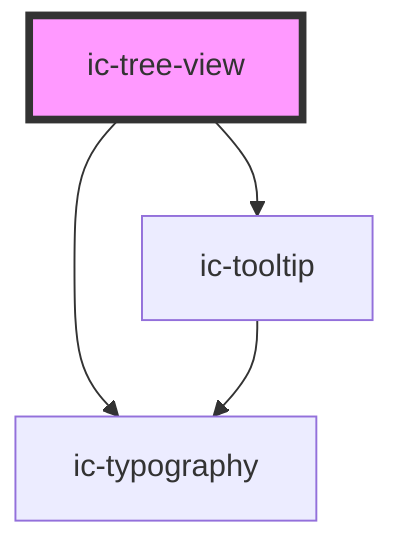

# ic-tree-view

<!-- Auto Generated Below -->

## Properties

| Property            | Attribute             | Description                                                                                                                                                                         | Type                             | Default     |
| ------------------- | --------------------- | ----------------------------------------------------------------------------------------------------------------------------------------------------------------------------------- | -------------------------------- | ----------- |
| `focusInset`        | `focus-inset`         | If `true`, tree items will have inset focus.                                                                                                                                        | `boolean`                        | `false`     |
| `heading`           | `heading`             | The heading of the tree view.                                                                                                                                                       | `string`                         | `""`        |
| `size`              | `size`                | The size of the tree view.                                                                                                                                                          | `"large" \| "medium" \| "small"` | `"medium"`  |
| `theme`             | `theme`               | Sets the theme color to the dark or light theme color. "inherit" will set the color based on the system settings or ic-theme component.                                             | `"dark" \| "inherit" \| "light"` | `"inherit"` |
| `truncateHeading`   | `truncate-heading`    | If `true`, the tree view heading will be truncated instead of text wrapping. When used on small devices, this prop will be overridden and headings will be set to text-wrap.        | `boolean`                        | `false`     |
| `truncateTreeItems` | `truncate-tree-items` | If `true`, tree items will be truncated, unless they are individually overridden. When used on small devices, this prop will be overridden and tree-items will be set to text-wrap. | `boolean`                        | `false`     |

## Slots

| Slot        | Description                                   |
| ----------- | --------------------------------------------- |
| `"heading"` | Content is set as the tree view heading.      |
| `"icon"`    | Content is placed to the left of the heading. |

## CSS Custom Properties

| Name                | Description            |
| ------------------- | ---------------------- |
| `--tree-view-width` | Width of the tree view |

## Dependencies

### Depends on

- ic-tooltip
- ic-typography

### Graph

----------------------------------------------

