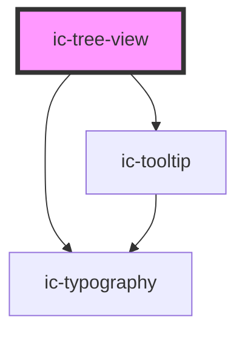

# ic-tree-view

<!-- Auto Generated Below -->

## Properties

| Property            | Attribute             | Description                                                                       | Type                              | Default     |
| ------------------- | --------------------- | --------------------------------------------------------------------------------- | --------------------------------- | ----------- |
| `appearance`        | `appearance`          | The appearance of the tree view, e.g. dark, or light.                             | `"dark" \| "light"`               | `"dark"`    |
| `heading`           | `heading`             | The heading of the tree view.                                                     | `string`                          | `""`        |
| `size`              | `size`                | The size of the tree view.                                                        | `"default" \| "large" \| "small"` | `"default"` |
| `truncateHeading`   | `truncate-heading`    | If `true`, the tree view heading will be truncated instead of text wrapping.      | `boolean`                         | `false`     |
| `truncateTreeItems` | `truncate-tree-items` | If `true`, tree items will be truncated, unless they are individually overridden. | `boolean`                         | `false`     |

## Slots

| Slot        | Description                                   |
| ----------- | --------------------------------------------- |
| `"heading"` | Content is set as the tree view heading.      |
| `"icon"`    | Content is placed to the left of the heading. |

## CSS Custom Properties

| Name                | Description            |
| ------------------- | ---------------------- |
| `--tree-view-width` | Width of the tree view |

## Dependencies

### Depends on

- ic-tooltip
- ic-typography

### Graph

----------------------------------------------

