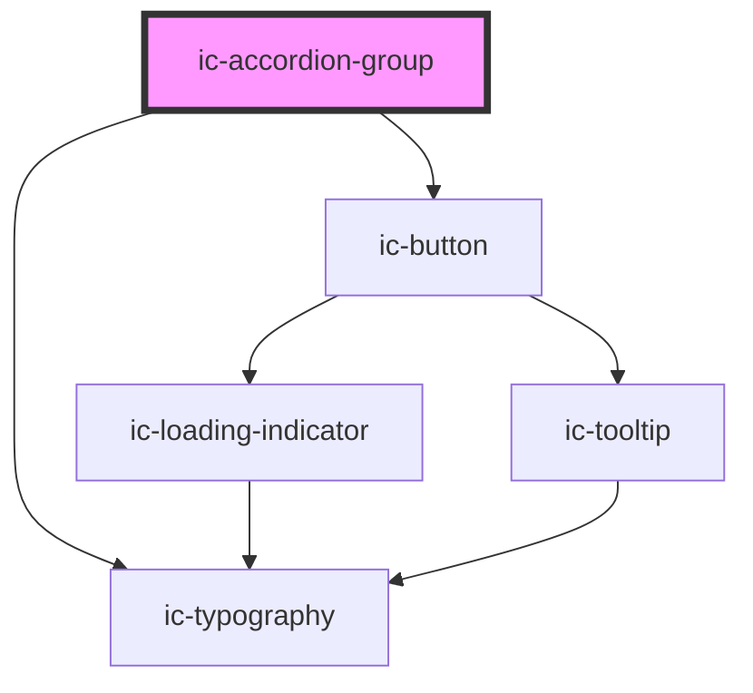

# ic-accordion-title

<!-- Auto Generated Below -->

## Properties

| Property                | Attribute                 | Description                                                                                                                             | Type                             | Default        |
| ----------------------- | ------------------------- | --------------------------------------------------------------------------------------------------------------------------------------- | -------------------------------- | -------------- |
| `accessibleButtonLabel` | `accessible-button-label` | The accessible button label to provide more context to the 'See all/Hide all' button for screen reader users.                           | `string`                         | `"accordions"` |
| `expanded`              | `expanded`                | If `true`, the accordion will load in an expanded state.                                                                                | `boolean`                        | `false`        |
| `label`                 | `label`                   | The header for the accordion group.                                                                                                     | `string`                         | `""`           |
| `singleExpansion`       | `single-expansion`        | If `true`, only one accordion will open at a time.                                                                                      | `boolean`                        | `false`        |
| `size`                  | `size`                    | The size of the accordion.                                                                                                              | `"large" \| "medium" \| "small"` | `"medium"`     |
| `theme`                 | `theme`                   | Sets the theme color to the dark or light theme color. "inherit" will set the color based on the system settings or ic-theme component. | `"dark" \| "inherit" \| "light"` | `"inherit"`    |

## Methods

### `setFocus() => Promise<void>`

Sets the focus on first focusable element in the accordion group. If the "See/Hide all" button is present, it will be focused.
Otherwise, the first accordion will be focused.

#### Returns

Type: `Promise<void>`

## Slots

| Slot      | Description                                     |
| --------- | ----------------------------------------------- |
| `"label"` | Content is placed as the accordion group title. |

## Dependencies

### Depends on

- [ic-typography](../ic-typography)
- [ic-button](../ic-button)

### Graph

----------------------------------------------

