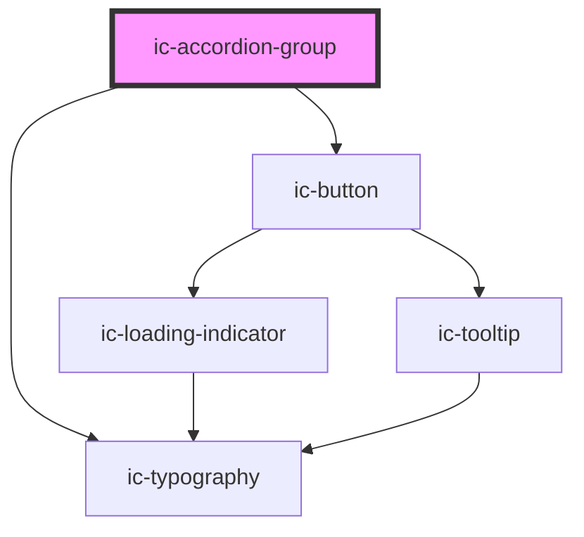

# ic-accordion-title

<!-- Auto Generated Below -->

## Properties

| Property          | Attribute          | Description                                                | Type                              | Default     |
| ----------------- | ------------------ | ---------------------------------------------------------- | --------------------------------- | ----------- |
| `appearance`      | `appearance`       | The appearance of the accordion group, e.g dark, or light. | `"dark" \| "default" \| "light"`  | `"default"` |
| `expanded`        | `expanded`         | If `true`, the accordion will load in an expanded state.   | `boolean`                         | `false`     |
| `groupTitle`      | `group-title`      | The header for the accordion group.                        | `string`                          | `""`        |
| `singleExpansion` | `single-expansion` | If `true`, only one accordion will open at a time.         | `boolean`                         | `false`     |
| `size`            | `size`             | The size of the accordion.                                 | `"default" \| "large" \| "small"` | `"default"` |

## Dependencies

### Depends on

- [ic-typography](../ic-typography)
- [ic-button](../ic-button)

### Graph

----------------------------------------------

