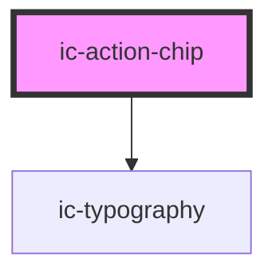

# ic-action-chip

<!-- Auto Generated Below -->

## Properties

| Property                | Attribute                | Description                                                                                                                                                       | Type                                                                                                                                                                                                  | Default     |
| ----------------------- | ------------------------ | ----------------------------------------------------------------------------------------------------------------------------------------------------------------- | ----------------------------------------------------------------------------------------------------------------------------------------------------------------------------------------------------- | ----------- |
| `disabled`              | `disabled`               | If `true`, the chip will appear disabled.                                                                                                                         | `boolean`                                                                                                                                                                                             | `false`     |
| `download`              | `download`               | If `true`, the user can save the linked URL instead of navigating to it.                                                                                          | `boolean \| string`                                                                                                                                                                                   | `false`     |
| `form`                  | `form`                   | The <form> element to associate the chip with.                                                                                                                    | `string \| undefined`                                                                                                                                                                                 | `undefined` |
| `formaction`            | `formaction`             | The URL that processes the information submitted by the chip. It overrides the action attribute of the chip's form owner. Does nothing if there is no form owner. | `string \| undefined`                                                                                                                                                                                 | `undefined` |
| `formenctype`           | `formenctype`            | The way the submitted form data is encoded.                                                                                                                       | `string \| undefined`                                                                                                                                                                                 | `undefined` |
| `formmethod`            | `formmethod`             | The HTTP method used to submit the form.                                                                                                                          | `string \| undefined`                                                                                                                                                                                 | `undefined` |
| `formnovalidate`        | `formnovalidate`         | If `true`, the form will not be validated when submitted.                                                                                                         | `boolean \| undefined`                                                                                                                                                                                | `undefined` |
| `formtarget`            | `formtarget`             | The place to display the response from submitting the form. It overrides the target attribute of the chip's form owner.                                           | `string \| undefined`                                                                                                                                                                                 | `undefined` |
| `href`                  | `href`                   | The URL that the link points to. This will render the chip as an "a" tag.                                                                                         | `string \| undefined`                                                                                                                                                                                 | `undefined` |
| `hreflang`              | `hreflang`               | The human language of the linked URL.                                                                                                                             | `string \| undefined`                                                                                                                                                                                 | `undefined` |
| `label` _(required)_    | `label`                  | The text rendered within the chip.                                                                                                                                | `string`                                                                                                                                                                                              | `undefined` |
| `monochrome`            | `monochrome`             | If `true`, the button will display as monochromatic in either `light` or `dark` theme.                                                                            | `boolean`                                                                                                                                                                                             | `false`     |
| `referrerpolicy`        | `referrerpolicy`         | How much of the referrer to send when following the link.                                                                                                         | `"" \| "no-referrer" \| "no-referrer-when-downgrade" \| "origin" \| "origin-when-cross-origin" \| "same-origin" \| "strict-origin" \| "strict-origin-when-cross-origin" \| "unsafe-url" \| undefined` | `undefined` |
| `rel`                   | `rel`                    | The relationship of the linked URL as space-separated link types.                                                                                                 | `string \| undefined`                                                                                                                                                                                 | `undefined` |
| `size`                  | `size`                   | The size of the chip.                                                                                                                                             | `"large" \| "medium" \| "small"`                                                                                                                                                                      | `"medium"`  |
| `target`                | `target`                 | The place to display the linked URL, as the name for a browsing context (a tab, window, or iframe).                                                               | `string \| undefined`                                                                                                                                                                                 | `undefined` |
| `theme`                 | `theme`                  | Sets the chip to the dark or light theme colors. "inherit" will set the color based on the system settings or ic-theme component.                                 | `"dark" \| "inherit" \| "light"`                                                                                                                                                                      | `"inherit"` |
| `transparentBackground` | `transparent-background` | If `true`, the outlined variant of chip will have a transparent background rather than the theme defined color.                                                   | `boolean`                                                                                                                                                                                             | `true`      |
| `type`                  | `type`                   | The type of the chip.                                                                                                                                             | `"button" \| "reset" \| "submit"`                                                                                                                                                                     | `"button"`  |
| `variant`               | `variant`                | The emphasis of the chip.                                                                                                                                         | `"filled" \| "outlined"`                                                                                                                                                                              | `"filled"`  |

## Methods

### `setFocus() => Promise<void>`

Sets focus on the chip.

#### Returns

Type: `Promise<void>`

## Slots

| Slot      | Description                                           |
| --------- | ----------------------------------------------------- |
| `"badge"` | Badge component overlaying the top right of the chip. |
| `"icon"`  | Content will be rendered at the start of the chip.    |

## Dependencies

### Depends on

- [ic-typography](../ic-typography)

### Graph

----------------------------------------------

