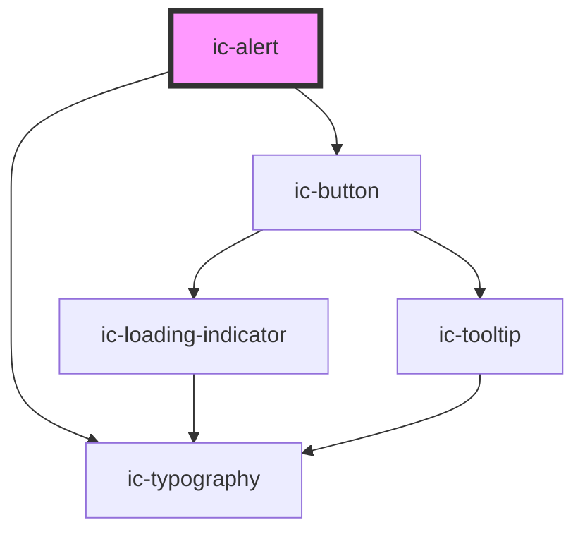

# ic-alert

<!-- Auto Generated Below -->

## Properties

| Property      | Attribute     | Description                                                                             | Type                                                       | Default     |
| ------------- | ------------- | --------------------------------------------------------------------------------------- | ---------------------------------------------------------- | ----------- |
| `announced`   | `announced`   | Set whether the alert has the 'alert' aria role and will be announced to screen readers | `boolean`                                                  | `true`      |
| `dismissible` | `dismissible` | Set whether the alert has a close icon at the end to dismiss it                         | `boolean`                                                  | `false`     |
| `heading`     | `heading`     | Optional title to display at the start of the alert                                     | `string`                                                   | `""`        |
| `message`     | `message`     | Main body message of the alert                                                          | `string`                                                   | `undefined` |
| `titleAbove`  | `title-above` | Set whether the title and message appear inline or above and below                      | `boolean`                                                  | `false`     |
| `variant`     | `variant`     | Set which variant of the alert will be rendered                                         | `"error" \| "info" \| "neutral" \| "success" \| "warning"` | `"neutral"` |

## Events

| Event     | Description                                   | Type                |
| --------- | --------------------------------------------- | ------------------- |
| `dismiss` | Is emitted when the user dismisses the alert. | `CustomEvent<void>` |

## Slots

| Slot        | Description                                   |
| ----------- | --------------------------------------------- |
| `"action"`  | Content is placed to the left of the message. |
| `"message"` | Content is placed to the right of the title.  |

## Dependencies

### Depends on

- [ic-typography](../ic-typography)
- [ic-button](../ic-button)

### Graph

----------------------------------------------

