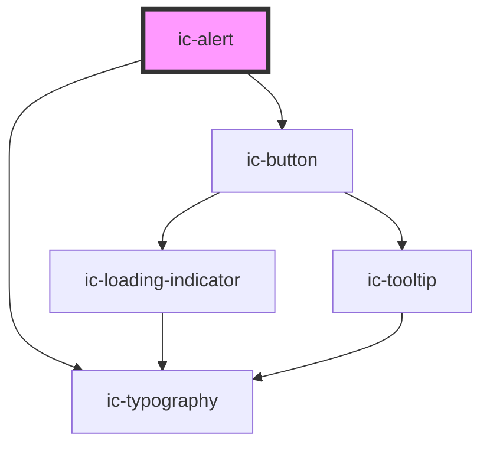

# ic-alert

<!-- Auto Generated Below -->

## Properties

| Property      | Attribute     | Description                                                                                   | Type                                                       | Default     |
| ------------- | ------------- | --------------------------------------------------------------------------------------------- | ---------------------------------------------------------- | ----------- |
| `announced`   | `announced`   | If `true`, the alert will have the 'alert' ARIA role and will be announced to screen readers. | `boolean`                                                  | `true`      |
| `dismissible` | `dismissible` | If `true`, the alert will have a close icon at the end to dismiss it.                         | `boolean`                                                  | `false`     |
| `heading`     | `heading`     | The optional title to display at the start of the alert.                                      | `string`                                                   | `""`        |
| `message`     | `message`     | The main body message of the alert.                                                           | `string`                                                   | `undefined` |
| `titleAbove`  | `title-above` | If `true`, the title and message will appear inline instead of above and below.               | `boolean`                                                  | `false`     |
| `variant`     | `variant`     | The variant of the alert which will be rendered.                                              | `"error" \| "info" \| "neutral" \| "success" \| "warning"` | `"neutral"` |

## Events

| Event       | Description                                                                                                             | Type                |
| ----------- | ----------------------------------------------------------------------------------------------------------------------- | ------------------- |
| `dismiss`   | **[DEPRECATED]** This event should not be used anymore. Use icDismiss instead.   | `CustomEvent<void>` |
| `icDismiss` | Is emitted when the user dismisses the alert.                                                                           | `CustomEvent<void>` |

## Slots

| Slot        | Description                                    |
| ----------- | ---------------------------------------------- |
| `"action"`  | Content is placed to the right of the message. |
| `"message"` | Content is placed to the right of the title.   |

## Dependencies

### Depends on

- [ic-typography](../ic-typography)
- [ic-button](../ic-button)

### Graph

----------------------------------------------

