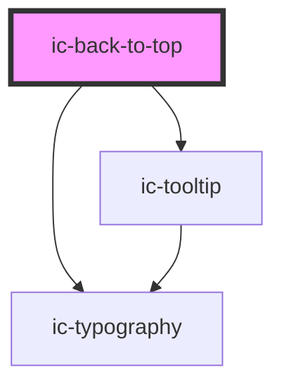

# ic-back-to-top

<!-- Auto Generated Below -->

## Properties

| Property              | Attribute | Description                                                     | Type                  | Default     |
| --------------------- | --------- | --------------------------------------------------------------- | --------------------- | ----------- |
| `target` _(required)_ | `target`  | The ID of the element to jump back to when the link is clicked. | `string`              | `undefined` |
| `variant`             | `variant` | The variant of the button to render                             | `"default" \| "icon"` | `"default"` |

## CSS Custom Properties

| Name                       | Description            |
| -------------------------- | ---------------------- |
| `--ic-z-index-back-to-top` | z-index of back to top |

## Dependencies

### Depends on

- [ic-typography](../ic-typography)
- [ic-tooltip](../ic-tooltip)

### Graph

----------------------------------------------

