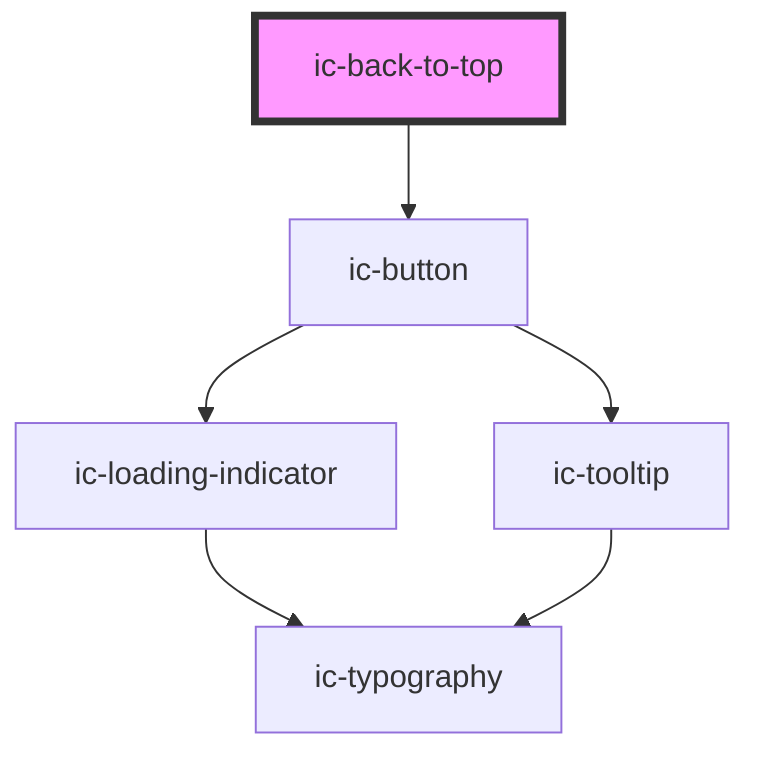

# ic-back-to-top

<!-- Auto Generated Below -->

## Properties

| Property              | Attribute  | Description                                                                                                                             | Type                                          | Default     |
| --------------------- | ---------- | --------------------------------------------------------------------------------------------------------------------------------------- | --------------------------------------------- | ----------- |
| `position`            | `position` | The horizontal position of the element.                                                                                                 | `"center" \| "left" \| "right" \| undefined`  | `"right"`   |
| `target` _(required)_ | `target`   | The ID of the element to jump back to when the link is clicked.                                                                         | `string`                                      | `undefined` |
| `theme`               | `theme`    | Sets the theme color to the dark or light theme color. "inherit" will set the color based on the system settings or ic-theme component. | `"dark" \| "inherit" \| "light" \| undefined` | `"inherit"` |
| `variant`             | `variant`  | The variant of the button to render                                                                                                     | `"default" \| "icon" \| undefined`            | `"default"` |

## CSS Custom Properties

| Name                       | Description                      |
| -------------------------- | -------------------------------- |
| `--footer-offset`          | offset of x-position from footer |
| `--ic-z-index-back-to-top` | z-index of back to top           |
| `--margin-left`            | left y-position of back to top   |
| `--margin-right`           | right y-position of back to top  |

## Dependencies

### Depends on

- [ic-button](../ic-button)

### Graph

----------------------------------------------

