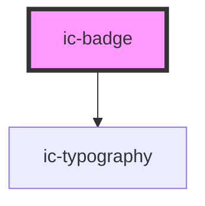

# ic-badge

<!-- Auto Generated Below -->

## Properties

| Property          | Attribute          | Description                                                                                                                                                                             | Type                                                                              | Default     |
| ----------------- | ------------------ | --------------------------------------------------------------------------------------------------------------------------------------------------------------------------------------- | --------------------------------------------------------------------------------- | ----------- |
| `accessibleLabel` | `accessible-label` | The accessible label of the badge component to provide context for screen reader users.                                                                                                 | `string`                                                                          | `undefined` |
| `customColor`     | `custom-color`     | The custom badge colour. This will only style the badge component if variant="custom". Can be a hex value e.g. "#ff0000", RGB e.g. "rgb(255, 0, 0)", or RGBA e.g. "rgba(255, 0, 0, 1)". | ``#${string}` \| `rgb(${string})` \| `rgba(${string})``                           | `null`      |
| `label`           | `label`            | The text displayed in the badge. This will only be displayed if type="text".                                                                                                            | `string`                                                                          | `undefined` |
| `maxNumber`       | `max-number`       | The maximum number shown on the badge appended with a +. This will only be displayed if type="text" and label is not empty.                                                             | `number`                                                                          | `undefined` |
| `position`        | `position`         | The positioning of the badge in reference to the parent element.                                                                                                                        | `"far" \| "inline" \| "near"`                                                     | `"far"`     |
| `size`            | `size`             | The size of the badge to be displayed.                                                                                                                                                  | `"large" \| "medium" \| "small"`                                                  | `"medium"`  |
| `theme`           | `theme`            | Sets the theme color to the dark or light theme color. "inherit" will set the color based on the system settings or ic-theme component.                                                 | `"dark" \| "inherit" \| "light"`                                                  | `"inherit"` |
| `type`            | `type`             | The type of badge to be displayed.                                                                                                                                                      | `"dot" \| "icon" \| "text"`                                                       | `"text"`    |
| `variant`         | `variant`          | The variant of the badge to be displayed.                                                                                                                                               | `"custom" \| "error" \| "info" \| "light" \| "neutral" \| "success" \| "warning"` | `"neutral"` |
| `visible`         | `visible`          | If `true`, the badge will be displayed.                                                                                                                                                 | `boolean`                                                                         | `true`      |

## Slots

| Slot           | Description                                                    |
| -------------- | -------------------------------------------------------------- |
| `"badge-icon"` | Icon will be rendered inside the badge if type is set to icon. |

## Dependencies

### Depends on

- [ic-typography](../ic-typography)

### Graph

----------------------------------------------

