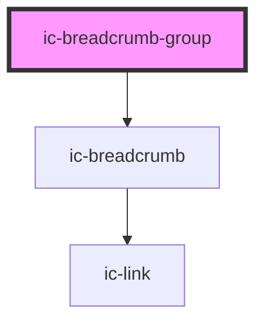

# ic-breadcrumb-group

<!-- Auto Generated Below -->

## Properties

| Property             | Attribute              | Description                                                                         | Type      | Default |
| -------------------- | ---------------------- | ----------------------------------------------------------------------------------- | --------- | ------- |
| `backBreadcrumbOnly` | `back-breadcrumb-only` | If `true`, display only a single breadcrumb for the parent page with a back icon.   | `boolean` | `false` |
| `collapsed`          | `collapsed`            | If `true`, all breadcrumbs between the first and last breadcrumb will be collapsed. | `boolean` | `false` |

## Dependencies

### Depends on

- [ic-breadcrumb](../ic-breadcrumb)

### Graph

----------------------------------------------

