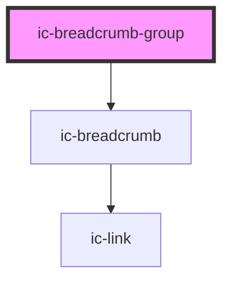

# ic-breadcrumb-group

<!-- Auto Generated Below -->

## Properties

| Property             | Attribute              | Description                                                                                                                             | Type                             | Default     |
| -------------------- | ---------------------- | --------------------------------------------------------------------------------------------------------------------------------------- | -------------------------------- | ----------- |
| `backBreadcrumbOnly` | `back-breadcrumb-only` | If `true`, display only a single breadcrumb for the parent page with a back icon.                                                       | `boolean`                        | `false`     |
| `collapsed`          | `collapsed`            | If `true`, all breadcrumbs between the first and last breadcrumb will be collapsed.                                                     | `boolean`                        | `false`     |
| `monochrome`         | `monochrome`           | If `true`, the breadcrumb group will display as black in the light theme, and white in the dark theme.                                  | `boolean`                        | `false`     |
| `theme`              | `theme`                | Sets the theme color to the dark or light theme color. "inherit" will set the color based on the system settings or ic-theme component. | `"dark" \| "inherit" \| "light"` | `"inherit"` |

## Dependencies

### Depends on

- [ic-breadcrumb](../ic-breadcrumb)

### Graph

----------------------------------------------

