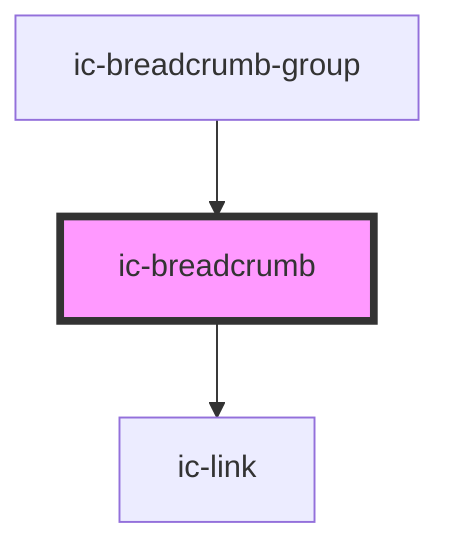

# ic-breadcrumb

<!-- Auto Generated Below -->

## Properties

| Property                 | Attribute    | Description                                         | Type      | Default     |
| ------------------------ | ------------ | --------------------------------------------------- | --------- | ----------- |
| `current`                | `current`    | If true, aria-current will be set on the breadcrumb | `boolean` | `false`     |
| `href`                   | `href`       | Set breadcrumb location                             | `string`  | `undefined` |
| `pageTitle` _(required)_ | `page-title` | Set breadcrumb title                                | `string`  | `undefined` |

## Dependencies

### Used by

 - [ic-breadcrumb-group](../ic-breadcrumb-group)

### Depends on

- [ic-link](../ic-link)

### Graph

----------------------------------------------

