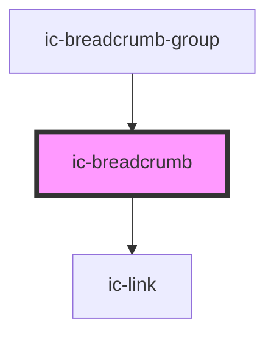

# ic-breadcrumb

<!-- Auto Generated Below -->

## Properties

| Property                 | Attribute    | Description                                            | Type      | Default     |
| ------------------------ | ------------ | ------------------------------------------------------ | --------- | ----------- |
| `current`                | `current`    | If `true`, aria-current will be set on the breadcrumb. | `boolean` | `false`     |
| `href`                   | `href`       | The URL that the breadcrumb link points to.            | `string`  | `undefined` |
| `pageTitle` _(required)_ | `page-title` | The title of the breadcrumb.                           | `string`  | `undefined` |

## Methods

### `setFocus() => Promise<void>`

Sets focus on the breadcrumb.

#### Returns

Type: `Promise<void>`

## Dependencies

### Used by

 - [ic-breadcrumb-group](../ic-breadcrumb-group)

### Depends on

- [ic-link](../ic-link)

### Graph

----------------------------------------------

