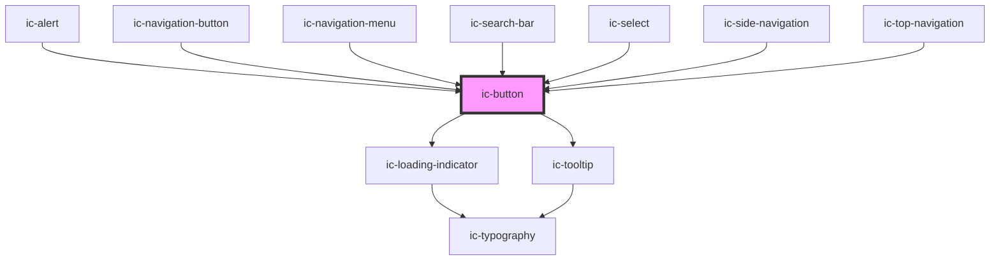

# ic-button

<!-- Auto Generated Below -->

## Properties

| Property           | Attribute           | Description                                                                                                      | Type                                                                                                                                                                                     | Default     |
| ------------------ | ------------------- | ---------------------------------------------------------------------------------------------------------------- | ---------------------------------------------------------------------------------------------------------------------------------------------------------------------------------------- | ----------- |
| `appearance`       | `appearance`        | Determines the whether the appearance of the button is dark, light, or the default.                              | `"dark" \| "default" \| "light"`                                                                                                                                                         | `"default"` |
| `disableTooltip`   | `disable-tooltip`   | Disable ic-tooltip which is shown for icon variant. Title or aria-label must be set if this prop is not applied. | `boolean`                                                                                                                                                                                | `false`     |
| `disabled`         | `disabled`          | Determines whether the button should be in disabled state.                                                       | `boolean`                                                                                                                                                                                | `false`     |
| `download`         | `download`          | Prompts the user to save the linked URL instead of navigating to it.                                             | `boolean \| string`                                                                                                                                                                      | `false`     |
| `fullWidth`        | `full-width`        | Fill the width of the container if true.                                                                         | `boolean`                                                                                                                                                                                | `false`     |
| `href`             | `href`              | The URL that the link points to. This will render the button as an "a" tag.                                      | `string`                                                                                                                                                                                 | `undefined` |
| `hreflang`         | `hreflang`          | Hints at the human language of the linked URL.                                                                   | `string`                                                                                                                                                                                 | `undefined` |
| `loading`          | `loading`           | Determines whether the button should be in loading state.                                                        | `boolean`                                                                                                                                                                                | `false`     |
| `referrerpolicy`   | `referrerpolicy`    | How much of the referrer to send when following the link.                                                        | `"" \| "no-referrer" \| "no-referrer-when-downgrade" \| "origin" \| "origin-when-cross-origin" \| "same-origin" \| "strict-origin" \| "strict-origin-when-cross-origin" \| "unsafe-url"` | `undefined` |
| `rel`              | `rel`               | The relationship of the linked URL as space-separated link types.                                                | `string`                                                                                                                                                                                 | `undefined` |
| `size`             | `size`              | The size of the button to be displayed.                                                                          | `"default" \| "large" \| "small"`                                                                                                                                                        | `"default"` |
| `target`           | `target`            | Where to display the linked URL, as the name for a browsing context (a tab, window, or iframe).                  | `string`                                                                                                                                                                                 | `undefined` |
| `tooltipPlacement` | `tooltip-placement` | The position of the tooltip in relation to the button.                                                           | `"bottom" \| "left" \| "right" \| "top"`                                                                                                                                                 | `"bottom"`  |
| `type`             | `type`              | The type of the button.                                                                                          | `"button" \| "reset" \| "submit"`                                                                                                                                                        | `"button"`  |
| `variant`          | `variant`           | The button variant to be displayed.                                                                              | `"destructive" \| "icon" \| "primary" \| "secondary" \| "tertiary"`                                                                                                                      | `"primary"` |

## Events

| Event     | Description                   | Type                |
| --------- | ----------------------------- | ------------------- |
| `icBlur`  | Emitted when button has blur  | `CustomEvent<void>` |
| `icFocus` | Emitted when button has focus | `CustomEvent<void>` |

## Methods

### `setFocus() => Promise<void>`

Sets focus on the native `button`

#### Returns

Type: `Promise<void>`

## Slots

| Slot     | Description                                             |
| -------- | ------------------------------------------------------- |
| `"icon"` | Content will be placed to the left of the button label. |

## Dependencies

### Used by

 - [ic-alert](../ic-alert)
 - [ic-navigation-button](../ic-navigation-button)
 - [ic-navigation-menu](../ic-navigation-menu)
 - [ic-search-bar](../ic-search-bar)
 - [ic-select](../ic-select)
 - [ic-side-navigation](../ic-side-navigation)
 - [ic-top-navigation](../ic-top-navigation)

### Depends on

- [ic-loading-indicator](../ic-loading-indicator)
- [ic-tooltip](../ic-tooltip)

### Graph

----------------------------------------------

