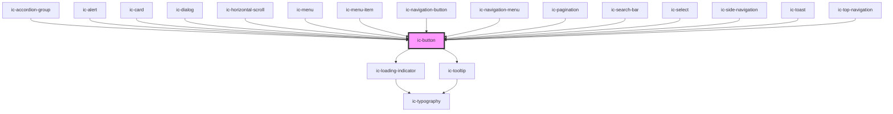

# ic-button

<!-- Auto Generated Below -->

## Properties

| Property           | Attribute           | Description                                                                                                                                                           | Type                                                                                                                                                                                     | Default     |
| ------------------ | ------------------- | --------------------------------------------------------------------------------------------------------------------------------------------------------------------- | ---------------------------------------------------------------------------------------------------------------------------------------------------------------------------------------- | ----------- |
| `appearance`       | `appearance`        | The appearance of the button, e.g. dark, light, or the default.                                                                                                       | `"dark" \| "default" \| "light"`                                                                                                                                                         | `"default"` |
| `disableTooltip`   | `disable-tooltip`   | If `true`, the ic-tooltip which is shown for icon variant will be disabled. Title or aria-label must be set if this prop is not applied.                              | `boolean`                                                                                                                                                                                | `false`     |
| `disabled`         | `disabled`          | If `true`, the button will be in disabled state.                                                                                                                      | `boolean`                                                                                                                                                                                | `false`     |
| `download`         | `download`          | If `true`, the user can save the linked URL instead of navigating to it.                                                                                              | `boolean \| string`                                                                                                                                                                      | `false`     |
| `form`             | `form`              | The <form> element to associate the button with.                                                                                                                      | `string`                                                                                                                                                                                 | `undefined` |
| `formaction`       | `formaction`        | The URL that processes the information submitted by the button. It overrides the action attribute of the button's form owner. Does nothing if there is no form owner. | `string`                                                                                                                                                                                 | `undefined` |
| `formenctype`      | `formenctype`       | The way the submitted form data is encoded.                                                                                                                           | `string`                                                                                                                                                                                 | `undefined` |
| `formmethod`       | `formmethod`        | The HTTP method used to submit the form.                                                                                                                              | `string`                                                                                                                                                                                 | `undefined` |
| `formnovalidate`   | `formnovalidate`    | If `true`, the form will not be validated when submitted.                                                                                                             | `boolean`                                                                                                                                                                                | `undefined` |
| `formtarget`       | `formtarget`        | The place to display the response from submitting the form. It overrides the target attribute of the button's form owner.                                             | `string`                                                                                                                                                                                 | `undefined` |
| `fullWidth`        | `full-width`        | If `true`, the button will fill the width of the container.                                                                                                           | `boolean`                                                                                                                                                                                | `false`     |
| `href`             | `href`              | The URL that the link points to. This will render the button as an "a" tag.                                                                                           | `string`                                                                                                                                                                                 | `undefined` |
| `hreflang`         | `hreflang`          | The human language of the linked URL.                                                                                                                                 | `string`                                                                                                                                                                                 | `undefined` |
| `loading`          | `loading`           | If `true`, the button will be in loading state.                                                                                                                       | `boolean`                                                                                                                                                                                | `false`     |
| `referrerpolicy`   | `referrerpolicy`    | How much of the referrer to send when following the link.                                                                                                             | `"" \| "no-referrer" \| "no-referrer-when-downgrade" \| "origin" \| "origin-when-cross-origin" \| "same-origin" \| "strict-origin" \| "strict-origin-when-cross-origin" \| "unsafe-url"` | `undefined` |
| `rel`              | `rel`               | The relationship of the linked URL as space-separated link types.                                                                                                     | `string`                                                                                                                                                                                 | `undefined` |
| `size`             | `size`              | The size of the button to be displayed.                                                                                                                               | `"default" \| "large" \| "small"`                                                                                                                                                        | `"default"` |
| `target`           | `target`            | The place to display the linked URL, as the name for a browsing context (a tab, window, or iframe).                                                                   | `string`                                                                                                                                                                                 | `undefined` |
| `tooltipPlacement` | `tooltip-placement` | The position of the tooltip in relation to the button.                                                                                                                | `"bottom" \| "left" \| "right" \| "top"`                                                                                                                                                 | `"bottom"`  |
| `type`             | `type`              | The type of the button.                                                                                                                                               | `"button" \| "reset" \| "submit"`                                                                                                                                                        | `"button"`  |
| `variant`          | `variant`           | The variant of the button to be displayed.                                                                                                                            | `"destructive" \| "icon" \| "primary" \| "secondary" \| "tertiary"`                                                                                                                      | `"primary"` |

## Events

| Event     | Description                   | Type                |
| --------- | ----------------------------- | ------------------- |
| `icBlur`  | Emitted when button has blur  | `CustomEvent<void>` |
| `icFocus` | Emitted when button has focus | `CustomEvent<void>` |

## Methods

### `setFocus() => Promise<void>`

Sets focus on the native `button`.

#### Returns

Type: `Promise<void>`

## Slots

| Slot           | Description                                                                                 |
| -------------- | ------------------------------------------------------------------------------------------- |
| `"icon"`       | Deprecated. This slot should not be used anymore. Use left-icon or right-icon slot instead. |
| `"left-icon"`  | Content will be placed to the left of the button label.                                     |
| `"right-icon"` | Content will be placed to the right of the button label.                                    |

## CSS Custom Properties

| Name          | Description                  |
| ------------- | ---------------------------- |
| `--height`    | The height of the button.    |
| `--min-width` | Minimum width of the button. |

## Dependencies

### Used by

 - [ic-accordion-group](../ic-accordion-group)
 - [ic-alert](../ic-alert)
 - [ic-card](../ic-card)
 - [ic-dialog](../ic-dialog)
 - [ic-horizontal-scroll](../ic-horizontal-scroll)
 - [ic-menu](../ic-menu)
 - [ic-menu-item](../ic-menu-item)
 - [ic-navigation-button](../ic-navigation-button)
 - [ic-navigation-menu](../ic-navigation-menu)
 - [ic-pagination](../ic-pagination)
 - [ic-search-bar](../ic-search-bar)
 - [ic-select](../ic-select)
 - [ic-side-navigation](../ic-side-navigation)
 - [ic-toast](../ic-toast)
 - [ic-top-navigation](../ic-top-navigation)

### Depends on

- [ic-loading-indicator](../ic-loading-indicator)
- [ic-tooltip](../ic-tooltip)

### Graph

----------------------------------------------

