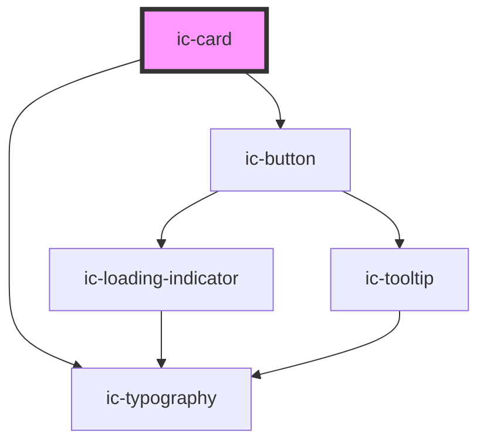

# ic-card

<!-- Auto Generated Below -->

## Properties

| Property               | Attribute        | Description                                                                                                                                      | Type                                                                                                                                                                                     | Default     |
| ---------------------- | ---------------- | ------------------------------------------------------------------------------------------------------------------------------------------------ | ---------------------------------------------------------------------------------------------------------------------------------------------------------------------------------------- | ----------- |
| `clickable`            | `clickable`      | If `true`, the card will be a clickable variant, instead of static.                                                                              | `boolean`                                                                                                                                                                                | `false`     |
| `disabled`             | `disabled`       | If `true`, the card will be disabled if it is clickable.                                                                                         | `boolean`                                                                                                                                                                                | `false`     |
| `expandable`           | `expandable`     | If `true`, the card will have an expandable area and expansion toggle button.                                                                    | `boolean`                                                                                                                                                                                | `false`     |
| `fullWidth`            | `full-width`     | If `true`, the card will fill the width of the container.                                                                                        | `boolean`                                                                                                                                                                                | `false`     |
| `heading` _(required)_ | `heading`        | The heading for the card.                                                                                                                        | `string`                                                                                                                                                                                 | `undefined` |
| `href`                 | `href`           | The URL that the clickable card link points to. If set, the clickable card will be rendered as an "a" tag, otherwise it will render as a button. | `string`                                                                                                                                                                                 | `undefined` |
| `hreflang`             | `hreflang`       | The human language of the linked URL.                                                                                                            | `string`                                                                                                                                                                                 | `""`        |
| `message`              | `message`        | The main body message of the card.                                                                                                               | `string`                                                                                                                                                                                 | `""`        |
| `referrerpolicy`       | `referrerpolicy` | How much of the referrer to send when following the link.                                                                                        | `"" \| "no-referrer" \| "no-referrer-when-downgrade" \| "origin" \| "origin-when-cross-origin" \| "same-origin" \| "strict-origin" \| "strict-origin-when-cross-origin" \| "unsafe-url"` | `undefined` |
| `rel`                  | `rel`            | The relationship of the linked URL as space-separated link types.                                                                                | `string`                                                                                                                                                                                 | `undefined` |
| `subheading`           | `subheading`     | The subheading for the card.                                                                                                                     | `string`                                                                                                                                                                                 | `undefined` |
| `target`               | `target`         | The place to display the linked URL, as the name for a browsing context (a tab, window, or iframe).                                              | `string`                                                                                                                                                                                 | `undefined` |

## Slots

| Slot                     | Description                                                                               |
| ------------------------ | ----------------------------------------------------------------------------------------- |
| `"adornment"`            | Content will be placed below the card subheading.                                         |
| `"expanded-content"`     | Content will be placed below the interaction controls but will not initially be rendered. |
| `"heading"`              | Content will be placed at the top of the card to the right of the icon.                   |
| `"icon"`                 | Content will be placed to the left of the card heading.                                   |
| `"image-mid"`            | Content will be placed below the card heading section.                                    |
| `"image-top"`            | Content will be placed at the top of the card above all other content.                    |
| `"interaction-button"`   | Content will be placed in the top right corner of the heading section.                    |
| `"interaction-controls"` | Content will be placed below the card message.                                            |
| `"message"`              | Content will be placed in the main body of the card.                                      |
| `"subheading"`           | Content will be placed below the card heading.                                            |

## Dependencies

### Depends on

- [ic-typography](../ic-typography)
- [ic-button](../ic-button)

### Graph

----------------------------------------------

