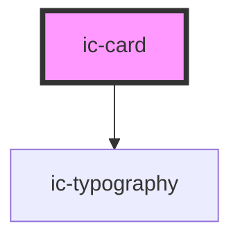

# ic-card

<!-- Auto Generated Below -->

## Properties

| Property               | Attribute        | Description                                                                                     | Type                                                                                                                                                                                     | Default     |
| ---------------------- | ---------------- | ----------------------------------------------------------------------------------------------- | ---------------------------------------------------------------------------------------------------------------------------------------------------------------------------------------- | ----------- |
| `clickable`            | `clickable`      | Set the variant to static or clickable                                                          | `boolean`                                                                                                                                                                                | `false`     |
| `disabled`             | `disabled`       | Whether the card is disabled if it is clickable                                                 | `boolean`                                                                                                                                                                                | `false`     |
| `fullWidth`            | `full-width`     | If true then fill width of container                                                            | `boolean`                                                                                                                                                                                | `false`     |
| `heading` _(required)_ | `heading`        | Title for the card                                                                              | `string`                                                                                                                                                                                 | `undefined` |
| `href`                 | `href`           | URL for clickable cards                                                                         | `string`                                                                                                                                                                                 | `undefined` |
| `hreflang`             | `hreflang`       | Human readable explanation of the URL                                                           | `string`                                                                                                                                                                                 | `""`        |
| `message`              | `message`        | Main body message of the card                                                                   | `string`                                                                                                                                                                                 | `""`        |
| `referrerpolicy`       | `referrerpolicy` | How much of the referrer to send when following the link.                                       | `"" \| "no-referrer" \| "no-referrer-when-downgrade" \| "origin" \| "origin-when-cross-origin" \| "same-origin" \| "strict-origin" \| "strict-origin-when-cross-origin" \| "unsafe-url"` | `undefined` |
| `rel`                  | `rel`            | The relationship of the linked URL as space-separated link types.                               | `string`                                                                                                                                                                                 | `undefined` |
| `target`               | `target`         | Where to display the linked URL, as the name for a browsing context (a tab, window, or iframe). | `string`                                                                                                                                                                                 | `undefined` |

## Slots

| Slot        | Description                                                             |
| ----------- | ----------------------------------------------------------------------- |
| `"heading"` | Content will be placed at the top of the card to the right of the icon. |
| `"icon"`    | Content will be placed to the left of the card title.                   |
| `"message"` | Content will be placed in the main body of the card.                    |

## Dependencies

### Depends on

- [ic-typography](../ic-typography)

### Graph

----------------------------------------------

