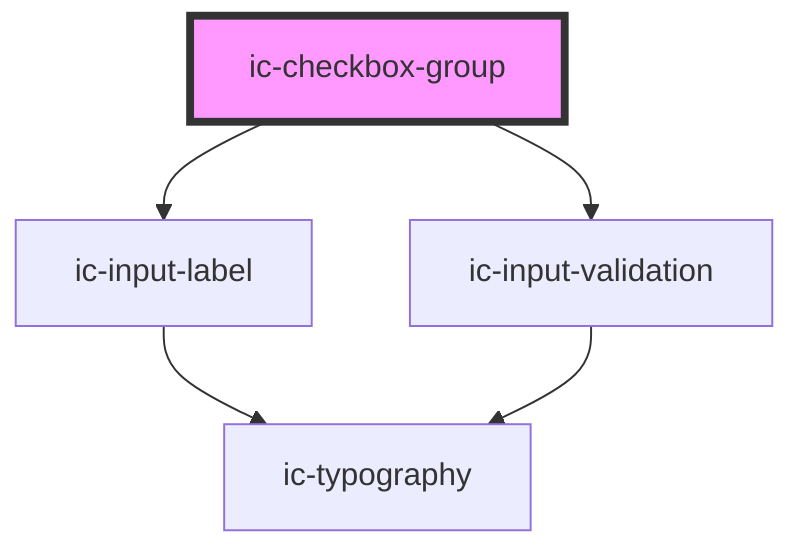

# ic-checkbox-group

<!-- Auto Generated Below -->

## Properties

| Property             | Attribute           | Description                                                            | Type                                      | Default     |
| -------------------- | ------------------- | ---------------------------------------------------------------------- | ----------------------------------------- | ----------- |
| `disabled`           | `disabled`          | Specify whether the input is disabled.                                 | `boolean`                                 | `false`     |
| `helperText`         | `helper-text`       | Provide helper text to display additional field guidance.              | `string`                                  | `""`        |
| `hideLabel`          | `hide-label`        | Hides the label and applies the required label value as an aria-label. | `boolean`                                 | `false`     |
| `label` _(required)_ | `label`             | Provide a label for the input.                                         | `string`                                  | `undefined` |
| `name` _(required)_  | `name`              | Provide a name for the input.                                          | `string`                                  | `undefined` |
| `required`           | `required`          | Specify if the input requires a value.                                 | `boolean`                                 | `false`     |
| `small`              | `small`             | Specify whether small styling to be applied to element.                | `boolean`                                 | `false`     |
| `validationStatus`   | `validation-status` | Provide validation status - 'error'                                    | `"" \| "error" \| "success" \| "warning"` | `""`        |
| `validationText`     | `validation-text`   | Provide validation text - 'error'                                      | `string`                                  | `""`        |

## Events

| Event      | Description                         | Type                               |
| ---------- | ----------------------------------- | ---------------------------------- |
| `icChange` | Emitted when a checkbox is checked. | `CustomEvent<IcChangeEventDetail>` |

## Dependencies

### Depends on

- [ic-input-label](../ic-input-label)
- [ic-input-validation](../ic-input-validation)

### Graph

----------------------------------------------

