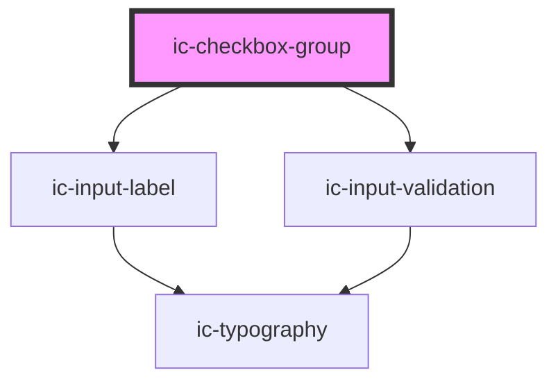

# ic-checkbox-group

<!-- Auto Generated Below -->

## Properties

| Property             | Attribute           | Description                                                                                                                         | Type                                      | Default     |
| -------------------- | ------------------- | ----------------------------------------------------------------------------------------------------------------------------------- | ----------------------------------------- | ----------- |
| `disabled`           | `disabled`          | If `true`, the checkbox group will be set to the disabled state.                                                                    | `boolean`                                 | `false`     |
| `helperText`         | `helper-text`       | The helper text that will be displayed for additional field guidance.                                                               | `string`                                  | `""`        |
| `hideLabel`          | `hide-label`        | If `true`, the label will be hidden and the required label value will be applied as an aria-label.                                  | `boolean`                                 | `false`     |
| `label` _(required)_ | `label`             | The label for the checkbox group to be displayed.                                                                                   | `string`                                  | `undefined` |
| `name` _(required)_  | `name`              | The name for the checkbox group to differentiate from other groups.                                                                 | `string`                                  | `undefined` |
| `required`           | `required`          | If `true`, the checkbox group will require a value.                                                                                 | `boolean`                                 | `false`     |
| `size`               | `size`              | The size of the checkboxes to be displayed. This does not affect the font size of the label.                                        | `"default" \| "large" \| "small"`         | `"default"` |
| `small`              | `small`             | **[DEPRECATED]** This prop should not be used anymore. Set prop `size` to "small" instead.   | `boolean`                                 | `false`     |
| `validationStatus`   | `validation-status` | The validation status - e.g. 'error' \| 'warning' \| 'success'.                                                                     | `"" \| "error" \| "success" \| "warning"` | `""`        |
| `validationText`     | `validation-text`   | The validation text - e.g. 'error' \| 'warning' \| 'success'.                                                                       | `string`                                  | `""`        |

## Events

| Event      | Description                         | Type                               |
| ---------- | ----------------------------------- | ---------------------------------- |
| `icChange` | Emitted when a checkbox is checked. | `CustomEvent<IcChangeEventDetail>` |

## Dependencies

### Depends on

- [ic-input-label](../ic-input-label)
- [ic-input-validation](../ic-input-validation)

### Graph

----------------------------------------------

