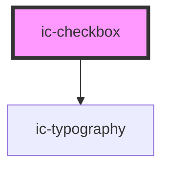

# ic-checkbox

<!-- Auto Generated Below -->

## Properties

| Property                 | Attribute                  | Description                                                  | Type                    | Default                                        |
| ------------------------ | -------------------------- | ------------------------------------------------------------ | ----------------------- | ---------------------------------------------- |
| `additionalFieldDisplay` | `additional-field-display` | Set which style of additionalField will be displayed if used | `"dynamic" \| "static"` | `"static"`                                     |
| `checked`                | `checked`                  | Set the checkbox to the checked state                        | `boolean`               | `false`                                        |
| `disabled`               | `disabled`                 | Set the checkbox to the disabled state                       | `boolean`               | `false`                                        |
| `dynamicText`            | `dynamic-text`             | Provide a text prop for the dynamic text                     | `string`                | `"This selection requires additional answers"` |
| `groupLabel`             | `group-label`              | Provide a group label for the input                          | `string`                | `undefined`                                    |
| `indeterminate`          | `indeterminate`            | Display the indeterminate state when checked                 | `boolean`               | `false`                                        |
| `label` _(required)_     | `label`                    | Provide a label for the input                                | `string`                | `undefined`                                    |
| `name`                   | `name`                     | Provide a name for the input                                 | `string`                | `undefined`                                    |
| `value` _(required)_     | `value`                    | Provide a value for the input                                | `string`                | `undefined`                                    |

## Events

| Event             | Description                              | Type                |
| ----------------- | ---------------------------------------- | ------------------- |
| `checkboxChecked` | Emitted when a checkbox has been checked | `CustomEvent<void>` |

## Dependencies

### Depends on

- [ic-typography](../ic-typography)

### Graph

----------------------------------------------

