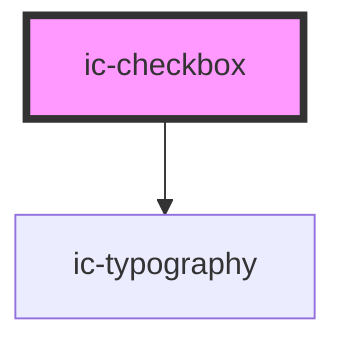

# ic-checkbox

<!-- Auto Generated Below -->

## Properties

| Property                 | Attribute                  | Description                                                                                                    | Type                    | Default                                        |
| ------------------------ | -------------------------- | -------------------------------------------------------------------------------------------------------------- | ----------------------- | ---------------------------------------------- |
| `additionalFieldDisplay` | `additional-field-display` | The style of additionalField that will be displayed if used.                                                   | `"dynamic" \| "static"` | `"static"`                                     |
| `checked`                | `checked`                  | If `true`, the checkbox will be set to the checked state.                                                      | `boolean`               | `false`                                        |
| `disabled`               | `disabled`                 | If `true`, the checkbox will be set to the disabled state.                                                     | `boolean`               | `false`                                        |
| `dynamicText`            | `dynamic-text`             | The text to be displayed when dynamic.                                                                         | `string`                | `"This selection requires additional answers"` |
| `groupLabel`             | `group-label`              | The group label for the checkbox.                                                                              | `string`                | `undefined`                                    |
| `indeterminate`          | `indeterminate`            | If `true`, the indeterminate state will be displayed when checked.                                             | `boolean`               | `false`                                        |
| `label` _(required)_     | `label`                    | The label for the checkbox.                                                                                    | `string`                | `undefined`                                    |
| `name`                   | `name`                     | The name for the checkbox. If not set when used in a checkbox group, the name will be based on the group name. | `string`                | `undefined`                                    |
| `small`                  | `small`                    | If true, the small styling will be applied to the checkbox.                                                    | `boolean`               | `false`                                        |
| `value` _(required)_     | `value`                    | The value for the checkbox.                                                                                    | `string`                | `undefined`                                    |

## Events

| Event             | Description                                                                                                           | Type                |
| ----------------- | --------------------------------------------------------------------------------------------------------------------- | ------------------- |
| `checkboxChecked` | **[DEPRECATED]** This event should not be used anymore. Use icCheck instead.   | `CustomEvent<void>` |
| `icCheck`         | Emitted when a checkbox has been checked.                                                                             | `CustomEvent<void>` |

## Methods

### `setFocus() => Promise<void>`

Sets focus on the checkbox.

#### Returns

Type: `Promise<void>`

## Dependencies

### Depends on

- [ic-typography](../ic-typography)

### Graph

----------------------------------------------

