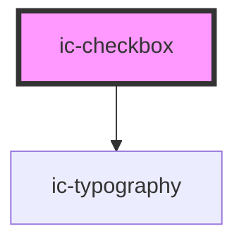

# ic-checkbox

<!-- Auto Generated Below -->

## Properties

| Property                       | Attribute                        | Description                                                                                                                                                                                   | Type                             | Default                                        |
| ------------------------------ | -------------------------------- | --------------------------------------------------------------------------------------------------------------------------------------------------------------------------------------------- | -------------------------------- | ---------------------------------------------- |
| `additionalFieldDisplay`       | `additional-field-display`       | The style of additionalField that will be displayed if used.                                                                                                                                  | `"dynamic" \| "static"`          | `"static"`                                     |
| `checked`                      | `checked`                        | If `true`, the checkbox will be set to the checked state.                                                                                                                                     | `boolean`                        | `false`                                        |
| `disabled`                     | `disabled`                       | If `true`, the checkbox will be set to the disabled state.                                                                                                                                    | `boolean`                        | `false`                                        |
| `dynamicText`                  | `dynamic-text`                   | The text to be displayed when dynamic.                                                                                                                                                        | `string`                         | `"This selection requires additional answers"` |
| `form`                         | `form`                           | The <form> element to associate the checkbox with.                                                                                                                                            | `string`                         | `undefined`                                    |
| `groupLabel`                   | `group-label`                    | The group label for the checkbox.                                                                                                                                                             | `string`                         | `undefined`                                    |
| `hideLabel`                    | `hide-label`                     | If `true`, the label will be hidden and the required label value will be applied as an aria-label.                                                                                            | `boolean`                        | `false`                                        |
| `indeterminate`                | `indeterminate`                  | If `true`, the indeterminate state will be displayed when checked.                                                                                                                            | `boolean`                        | `false`                                        |
| `label` _(required)_           | `label`                          | The label for the checkbox.                                                                                                                                                                   | `string`                         | `undefined`                                    |
| `name`                         | `name`                           | The name for the checkbox. If not set when used in a checkbox group, the name will be based on the group name.                                                                                | `string`                         | `undefined`                                    |
| `nativeIndeterminateBehaviour` | `native-indeterminate-behaviour` | If `true`, the checkbox will behave like a native checkbox where the `indeterminate` prop sets the indeterminate visual styling, independent of the `checked` state.                          | `boolean`                        | `false`                                        |
| `size`                         | `size`                           | The size of the checkbox to be displayed. This does not affect the font size of the label. If a checkbox is contained in a checkbox group, this will override the size set on checkbox group. | `"large" \| "medium" \| "small"` | `undefined`                                    |
| `theme`                        | `theme`                          | Sets the theme color to the dark or light theme color. "inherit" will set the color based on the system settings or ic-theme component.                                                       | `"dark" \| "inherit" \| "light"` | `"inherit"`                                    |
| `value` _(required)_           | `value`                          | The value for the checkbox.                                                                                                                                                                   | `string`                         | `undefined`                                    |

## Events

| Event     | Description                               | Type                |
| --------- | ----------------------------------------- | ------------------- |
| `icCheck` | Emitted when a checkbox has been checked. | `CustomEvent<void>` |

## Methods

### `setFocus() => Promise<void>`

Sets focus on the checkbox.

#### Returns

Type: `Promise<void>`

## Slots

| Slot                 | Description                                   |
| -------------------- | --------------------------------------------- |
| `"additional-field"` | Content to be displayed alongside a checkbox. |

## Dependencies

### Depends on

- [ic-typography](../ic-typography)

### Graph

----------------------------------------------

