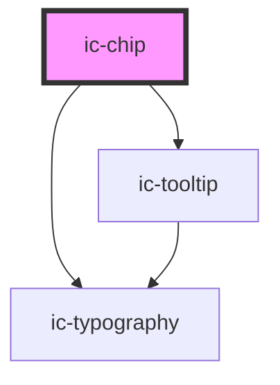

# ic-chip

<!-- Auto Generated Below -->

## Properties

| Property             | Attribute     | Description                                                            | Type                              | Default     |
| -------------------- | ------------- | ---------------------------------------------------------------------- | --------------------------------- | ----------- |
| `appearance`         | `appearance`  | The emphasis of the chip.                                              | `"filled" \| "outline"`           | `"filled"`  |
| `disabled`           | `disabled`    | If `true`, the chip will appear disabled.                              | `boolean`                         | `false`     |
| `dismissible`        | `dismissible` | If `true`, the chip will have a close button at the end to dismiss it. | `boolean`                         | `false`     |
| `label` _(required)_ | `label`       | The text rendered within the chip.                                     | `string`                          | `undefined` |
| `size`               | `size`        | The size of the chip.                                                  | `"default" \| "large" \| "small"` | `"default"` |

## Events

| Event       | Description                                                                                                             | Type                |
| ----------- | ----------------------------------------------------------------------------------------------------------------------- | ------------------- |
| `dismiss`   | **[DEPRECATED]** This event should not be used anymore. Use icDismiss instead.   | `CustomEvent<void>` |
| `icDismiss` | Is emitted when the user dismisses the chip.                                                                            | `CustomEvent<void>` |

## Methods

### `setFocus() => Promise<void>`

Sets focus on the chip.

#### Returns

Type: `Promise<void>`

## Slots

| Slot     | Description                                        |
| -------- | -------------------------------------------------- |
| `"icon"` | Content will be rendered at the start of the chip. |

## Dependencies

### Depends on

- [ic-typography](../ic-typography)
- [ic-tooltip](../ic-tooltip)

### Graph

----------------------------------------------

