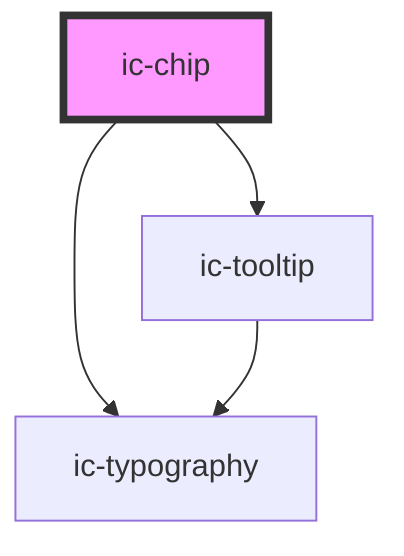

# ic-chip

<!-- Auto Generated Below -->

## Properties

| Property                | Attribute                | Description                                                                                                                                                                                                  | Type                                                    | Default     |
| ----------------------- | ------------------------ | ------------------------------------------------------------------------------------------------------------------------------------------------------------------------------------------------------------ | ------------------------------------------------------- | ----------- |
| `customColor`           | `custom-color`           | The custom chip colour. This prop will be applied to the chip component if `dismissible` is set to `false`. Can be a hex value e.g. "#ff0000", RGB e.g. "rgb(255, 0, 0)", or RGBA e.g. "rgba(255, 0, 0, 1)". | ``#${string}` \| `rgb(${string})` \| `rgba(${string})`` | `null`      |
| `disabled`              | `disabled`               | If `true`, the chip will appear disabled.                                                                                                                                                                    | `boolean`                                               | `false`     |
| `dismissible`           | `dismissible`            | If `true`, the chip will have a close button at the end to dismiss it.                                                                                                                                       | `boolean`                                               | `false`     |
| `label` _(required)_    | `label`                  | The text rendered within the chip.                                                                                                                                                                           | `string`                                                | `undefined` |
| `size`                  | `size`                   | The size of the chip.                                                                                                                                                                                        | `"large" \| "medium" \| "small"`                        | `"medium"`  |
| `transparentBackground` | `transparent-background` | If `true`, the outlined variant of chip will have a transparent background rather than white.                                                                                                                | `boolean`                                               | `true`      |
| `variant`               | `variant`                | The emphasis of the chip.                                                                                                                                                                                    | `"filled" \| "outlined"`                                | `"filled"`  |

## Events

| Event       | Description                                  | Type                |
| ----------- | -------------------------------------------- | ------------------- |
| `icDismiss` | Is emitted when the user dismisses the chip. | `CustomEvent<void>` |

## Methods

### `setFocus() => Promise<void>`

Sets focus on the chip.

#### Returns

Type: `Promise<void>`

## Slots

| Slot      | Description                                           |
| --------- | ----------------------------------------------------- |
| `"badge"` | Badge component overlaying the top right of the chip. |
| `"icon"`  | Content will be rendered at the start of the chip.    |

## Dependencies

### Depends on

- [ic-typography](../ic-typography)
- [ic-tooltip](../ic-tooltip)

### Graph

----------------------------------------------

