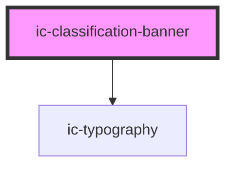

# ic-classification-banner

<!-- Auto Generated Below -->

## Properties

| Property              | Attribute              | Description                                                                                    | Type                                                                          | Default     |
| --------------------- | ---------------------- | ---------------------------------------------------------------------------------------------- | ----------------------------------------------------------------------------- | ----------- |
| `additionalSelectors` | `additional-selectors` | Additional information to display after the classification                                     | `string`                                                                      | `""`        |
| `classification`      | `classification`       | The classification level to be displayed also determines the banner and text colour            | `"default" \| "official" \| "official-sensitive" \| "secret" \| "top-secret"` | `"default"` |
| `country`             | `country`              | Optional text displayed before classification to specify relevant country/countries            | `string`                                                                      | `"uk"`      |
| `inline`              | `inline`               | Determines whether the banner appears inline with the page or sticks to the bottom of the page | `boolean`                                                                     | `false`     |
| `upTo`                | `up-to`                | Optionally display "Up to" before classification and country if set                            | `boolean`                                                                     | `false`     |

## Dependencies

### Depends on

- [ic-typography](../ic-typography)

### Graph

----------------------------------------------

