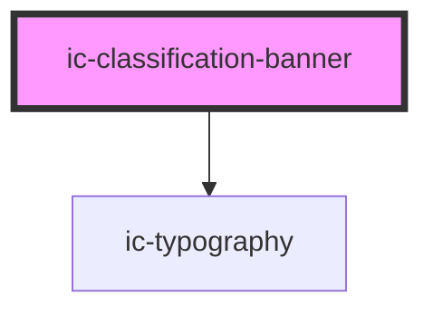

# ic-classification-banner

<!-- Auto Generated Below -->

## Properties

| Property              | Attribute              | Description                                                                                            | Type                                                                          | Default     |
| --------------------- | ---------------------- | ------------------------------------------------------------------------------------------------------ | ----------------------------------------------------------------------------- | ----------- |
| `additionalSelectors` | `additional-selectors` | The additional information that will be displayed after the classification.                            | `string`                                                                      | `""`        |
| `classification`      | `classification`       | The classification level to be displayed - also determines the banner and text colour.                 | `"default" \| "official" \| "official-sensitive" \| "secret" \| "top-secret"` | `"default"` |
| `country`             | `country`              | The optional text that will be displayed before classification to specify relevant country/countries.  | `string`                                                                      | `"uk"`      |
| `inline`              | `inline`               | If `true`, the banner will appear inline with the page, instead of sticking to the bottom of the page. | `boolean`                                                                     | `false`     |
| `upTo`                | `up-to`                | If `true`, "Up to" will be displayed before the classification and country.                            | `boolean`                                                                     | `false`     |

## CSS Custom Properties

| Name                                 | Description                      |
| ------------------------------------ | -------------------------------- |
| `--ic-z-index-classification-banner` | z-index of classification banner |

## Dependencies

### Depends on

- [ic-typography](../ic-typography)

### Graph

----------------------------------------------

