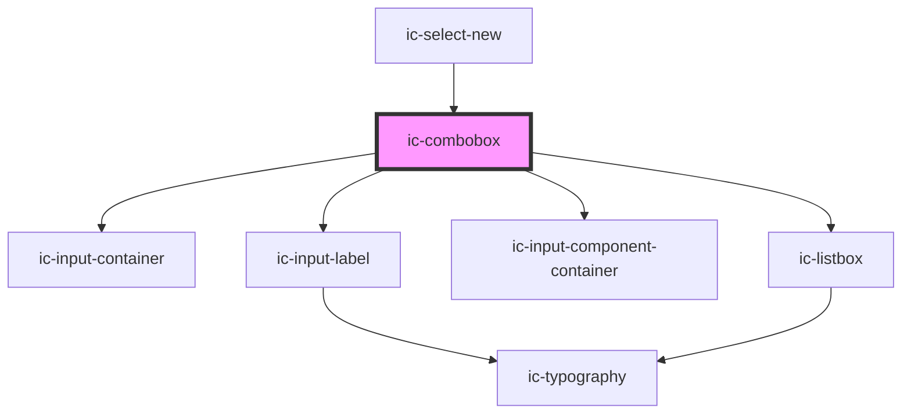

# ic-select-new

<!-- Auto Generated Below -->

## Properties

| Property              | Attribute                | Description                                                           | Type             | Default              |
| --------------------- | ------------------------ | --------------------------------------------------------------------- | ---------------- | -------------------- |
| `emptyOptionListText` | `empty-option-list-text` | The text displayed when there are no options in the option list.      | `string`         | `"No results found"` |
| `label` _(required)_  | `label`                  |                                                                       | `string`         | `undefined`          |
| `loadingLabel`        | `loading-label`          | The message displayed whilst the options are being loaded externally. | `string`         | `"Loading..."`       |
| `options`             | --                       | The possible selection options.                                       | `IcMenuOption[]` | `[]`                 |
| `searchable`          | `searchable`             |                                                                       | `boolean`        | `false`              |

## Dependencies

### Used by

 - [ic-select-new](../ic-select-new)

### Depends on

- [ic-input-container](../ic-input-container)
- [ic-input-label](../ic-input-label)
- [ic-input-component-container](../ic-input-component-container)
- [ic-listbox](../ic-listbox)

### Graph

----------------------------------------------

