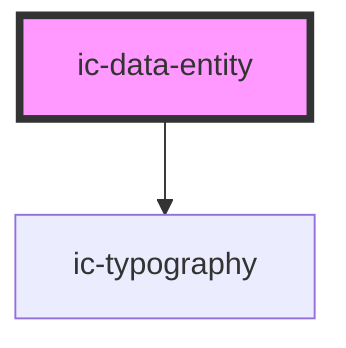

# ic-data-entity

<!-- Auto Generated Below -->

## Properties

| Property  | Attribute | Description                                                                                                                         | Type                   | Default     |
| --------- | --------- | ----------------------------------------------------------------------------------------------------------------------------------- | ---------------------- | ----------- |
| `heading` | `heading` | The title for the data entity.                                                                                                      | `string`               | `undefined` |
| `size`    | `size`    | The size of the data entity component.                                                                                              | `"default" \| "small"` | `"default"` |
| `small`   | `small`   | **[DEPRECATED]** This prop should not be used anymore. Set prop `size` to "small" instead.   | `boolean`              | `false`     |

## Dependencies

### Depends on

- [ic-typography](../ic-typography)

### Graph

----------------------------------------------

