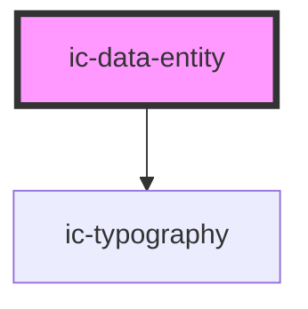

# ic-data-entity

<!-- Auto Generated Below -->

## Properties

| Property  | Attribute | Description                                                                               | Type      | Default     |
| --------- | --------- | ----------------------------------------------------------------------------------------- | --------- | ----------- |
| `heading` | `heading` | The title for the data entity.                                                            | `string`  | `undefined` |
| `small`   | `small`   | If `true`, the small styling will be applied to the data heading and all child data rows. | `boolean` | `false`     |

## Dependencies

### Depends on

- [ic-typography](../ic-typography)

### Graph

----------------------------------------------

