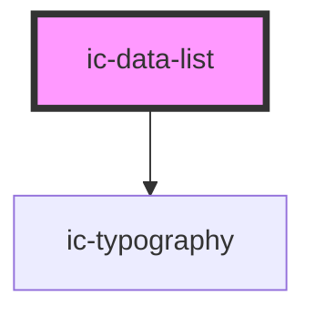

# ic-data-list

<!-- Auto Generated Below -->

## Properties

| Property  | Attribute | Description                                                                                                                             | Type                             | Default     |
| --------- | --------- | --------------------------------------------------------------------------------------------------------------------------------------- | -------------------------------- | ----------- |
| `heading` | `heading` | The title for the data list.                                                                                                            | `string`                         | `undefined` |
| `size`    | `size`    | The size of the data list component.                                                                                                    | `"medium" \| "small"`            | `"medium"`  |
| `theme`   | `theme`   | Sets the theme color to the dark or light theme color. "inherit" will set the color based on the system settings or ic-theme component. | `"dark" \| "inherit" \| "light"` | `"inherit"` |

## Slots

| Slot        | Description                                         |
| ----------- | --------------------------------------------------- |
| `"heading"` | Content will be placed at the top of the data list. |

## Dependencies

### Depends on

- [ic-typography](../ic-typography)

### Graph

----------------------------------------------

