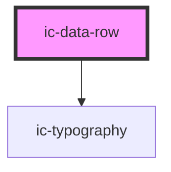

# ic-data-row

<!-- Auto Generated Below -->

## Properties

| Property | Attribute | Description                                                                                                                             | Type                             | Default     |
| -------- | --------- | --------------------------------------------------------------------------------------------------------------------------------------- | -------------------------------- | ----------- |
| `label`  | `label`   | The label in the leftmost cell of the row.                                                                                              | `string`                         | `undefined` |
| `size`   | `size`    | The size of the data row component.                                                                                                     | `"medium" \| "small"`            | `"medium"`  |
| `theme`  | `theme`   | Sets the theme color to the dark or light theme color. "inherit" will set the color based on the system settings or ic-theme component. | `"dark" \| "inherit" \| "light"` | `"inherit"` |
| `value`  | `value`   | The value of the middle (right if no end-component supplied) cell of the row.                                                           | `string`                         | `undefined` |

## Slots

| Slot              | Description                                         |
| ----------------- | --------------------------------------------------- |
| `"end-component"` | Content will be displayed in the rightmost cell.    |
| `"label"`         | Content will be rendered in the leftmost cell.      |
| `"value"`         | Content will be rendered to the right of the label. |

## Dependencies

### Depends on

- [ic-typography](../ic-typography)

### Graph

----------------------------------------------

