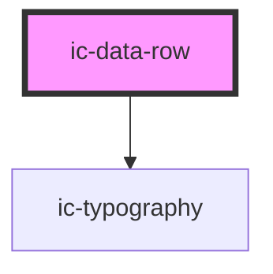

# ic-data-row

<!-- Auto Generated Below -->

## Properties

| Property | Attribute | Description                                                                                            | Type      | Default     |
| -------- | --------- | ------------------------------------------------------------------------------------------------------ | --------- | ----------- |
| `label`  | `label`   | Set the label in the leftmost cell of the row                                                          | `string`  | `undefined` |
| `small`  | `small`   | Set the row to small styling, this is automatically applied if small is set on the parent data heading | `boolean` | `false`     |
| `value`  | `value`   | Set the value of the middle (right if no addition supplied) cell of the row                            | `string`  | `undefined` |

## Slots

| Slot              | Description                                         |
| ----------------- | --------------------------------------------------- |
| `"end-component"` | Content will be displayed in the rightmost cell.    |
| `"label"`         | Content will be rendered in the leftmost cell.      |
| `"value"`         | Content will be rendered to the right of the label. |

## Dependencies

### Depends on

- [ic-typography](../ic-typography)

### Graph

----------------------------------------------

